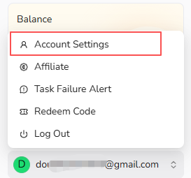
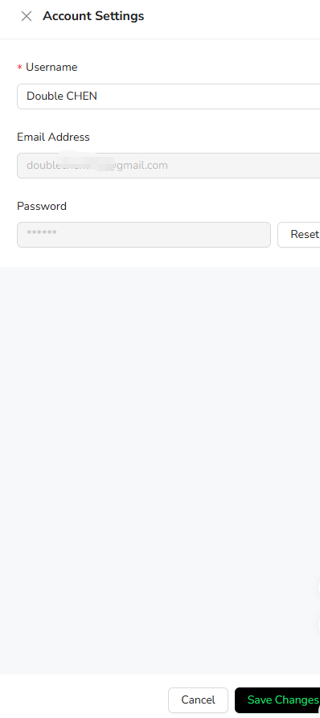

Account Settings currently supports changing your username and resetting your password. The email address linked to the account is displayed as read-only and cannot be changed.

## Open Account Settings

Open the account menu at the bottom of the BrowserAct dashboard and select `Account Settings`.

## Change Your Username

1. Update the `Username` field.
2. Select `Save Changes`.

## Reset Your Password

Select `Reset` beside the Password field and follow the password reset instructions.

Your account email cannot currently be changed from Account Settings.
