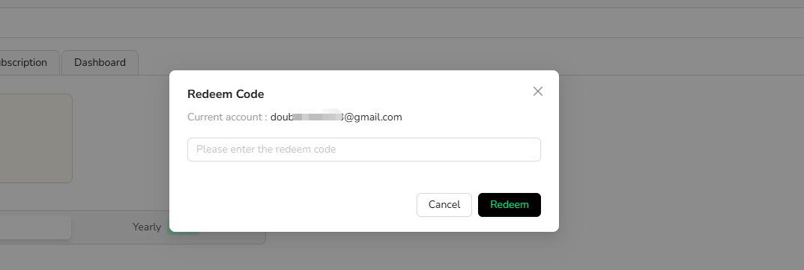

Use `Redeem Code` to apply an eligible BrowserAct redemption code to your account.

1. Open the account menu in the lower-left corner of the BrowserAct dashboard.
2. Select `Redeem Code`.

3. Enter the redemption code.
4. Complete the redemption.
5. Review your balance or plan information to confirm the result.

If the code is invalid, expired, already used, or not eligible for the account, keep the code and error message and contact support.
