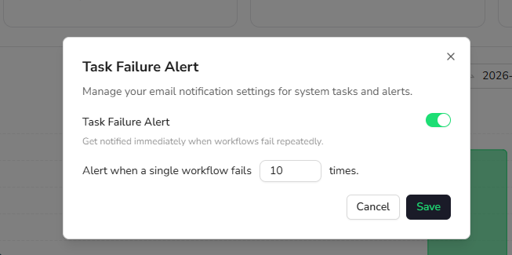

Task Failure Alert sends an email notification when the same Bot fails repeatedly. It helps you identify ongoing failures early and reduce the impact on scheduled or recurring tasks.

The alert is turned off by default.

## Enable the Alert

1. Open the account menu at the bottom of the BrowserAct dashboard.
2. Select `Task Failure Alert`.
3. Turn on `Task Failure Alert`.
4. Enter how many failures should trigger the notification.
5. Select `Save`.

BrowserAct sends the alert after a single Bot reaches the configured number of failures. Set a threshold that helps you catch repeated problems without creating unnecessary notifications.

To stop receiving these notifications, return to `Task Failure Alert`, turn it off, and save the change.
