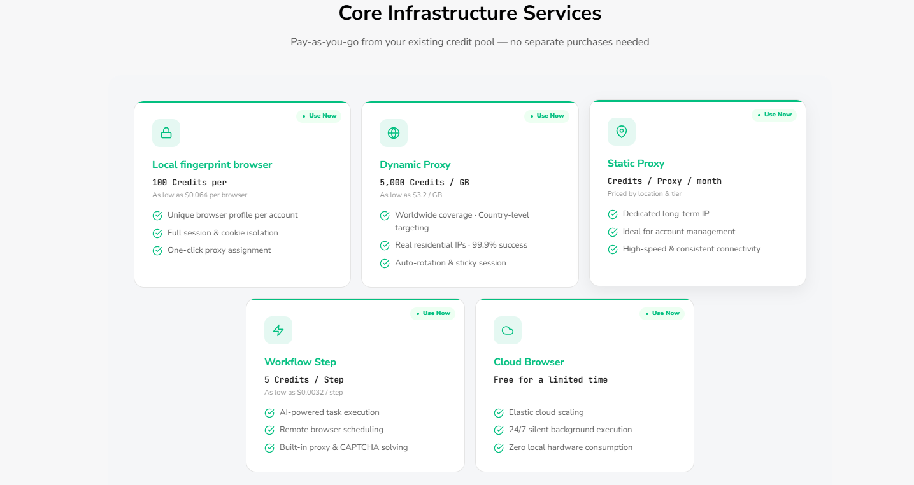

## How Credits Work

Credits are BrowserAct's unified billing unit. The same credit balance is used across BrowserAct services, including Agent Built Bot building and runs, Workflow Built Bot steps, Static Proxies, Dynamic Proxies, and local fingerprint browsers.

Different services consume credits in different ways:

- **Agent Built Bots:** Building and running a Bot consumes credits based on the task. Review the credits used in the related Task record.
- **Workflow Built Bots:** Each executed step consumes credits according to the Workflow step rules below.
- **Static Proxy:** Charged in credits per proxy per month. Pricing varies by location and tier.
- **Dynamic Proxy:** Charged by bandwidth at 5,000 credits per GB.
- **Local fingerprint browser:** Charged 100 credits each time a browser is created.
- **Cloud Browser:** Currently free for a limited time.

## Workflow Built Credit Calculation

The following calculation applies only to Workflow Built Bots.

**Basic formula:** 1 executed step = 5 credits.

Standard actions include:

- Navigate to page
- Click element
- Input text
- Extract data
- Wait
- Go back
- Scroll

Special actions are calculated as follows:

- Loop: loop count x 5
- Loop List: item count x 5
- Scroll to element: scroll count x 5

## Credit Deduction Priority

Credits are used in the following order:

1. **Monthly Credits:** Subscription or AppSumo credits valid for the current monthly cycle.
2. **Existing permanent balance:** Used afterward when a permanent balance is shown on the account.

Credit Packs are not permanent credits. They expire at the next monthly credit reset.

## Payment Methods

BrowserAct accepts **PayPal** and supported **credit or debit cards processed through Stripe**.

## Request an Invoice

1. Create a support ticket in the [BrowserAct Discord community](https://discord.com/invite/UpnCKd7GaU), or email [support@browseract.com](mailto:support@browseract.com).
2. Share the order information needed to identify the purchase.
3. BrowserAct Support will verify the order and issue the invoice.

Do not include full payment-card details, passwords, or other sensitive account information.

## Infrastructure Charges

### Static Proxy

Static Proxies are charged in credits per proxy per month. The exact price depends on the selected location and proxy tier. Review the displayed price before confirming the purchase.

### Dynamic Proxy

Dynamic Proxy traffic is charged at **5,000 credits per GB**. Total usage depends on the bandwidth consumed by your Tasks.

### Local Fingerprint Browser

Creating a local fingerprint browser costs **100 credits per browser**.

Each creation is charged separately. If you delete a browser and create a new one, the new browser costs another 100 credits. Deleting a browser does not refund its creation charge.

See the [BrowserAct Pricing page](https://www.browseract.com/pricing) for current public pricing information.

## Earn Bonus Credits

- **2,000 credits for an approved G2 review:** After G2 approves the review, send the approval screenshot to BrowserAct Support for verification.
- **New account registration reward:** Eligible new users may receive bonus credits. The amount is subject to change; review the offer shown during registration or in the current promotion.
- **500 credits for starring the BrowserAct GitHub repository:** Star the official repository and complete the current reward-verification process.

Rewards are subject to account eligibility and verification.
