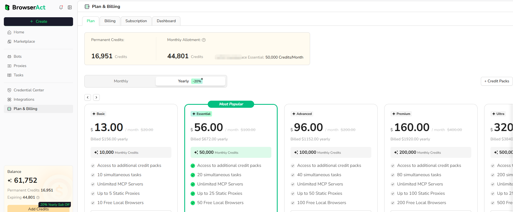

Use the Plan page to compare BrowserAct subscriptions and choose the billing cycle and account limits that fit your usage.

## Open the Plan Page

1. Open `Plan & Billing` from the BrowserAct dashboard.
2. Select the `Plan` tab.

## Review Your Credit Balance

The summary at the top can show:

- **Permanent Credits:** Credits that do not follow the monthly subscription reset when this balance is available on the account
- **Monthly Allotment:** Remaining credits from the current monthly allocation and the plan's monthly credit allowance

Credit Packs are not permanent credits. They expire at the next monthly credit reset.

## Choose a Billing Cycle

Use the `Monthly` and `Yearly` control to compare the available billing cycles.

- Monthly plans renew each month.
- Yearly plans are billed annually, while plan credits are allocated on a monthly cycle.
- Discounts, prices, and available plans can change. Review the values shown before purchase.

## Compare Plans

Each plan card shows its current price, monthly credits, and included limits. Depending on the plan, these can include:

- Concurrent Tasks
- MCP Servers
- Static Proxy allowance
- Included local fingerprint browsers
- Access to additional Credit Packs

Use the arrows beside the plan list to view additional plans when they do not fit on the screen.

## Buy Additional Credits

Eligible subscribed users and Lifetime Deal holders can select `Credit Packs` when the current monthly allocation is insufficient.

Credit Packs expire at the next monthly credit reset. Review the displayed expiration date before confirming a purchase.

## Upgrade Your Plan

### Upgrade Immediately

An immediate upgrade is available when more than 48 hours remain in the current monthly credit cycle.

- The upgraded plan benefits take effect immediately.
- You pay the displayed price difference between the current and upgraded plans.
- The difference in monthly credits is added to the current cycle.
- The original monthly credit reset date does not change.

### Upgrade at the Next Cycle

Choose a next-cycle upgrade when the new plan should start on the next monthly reset date.

- The current plan remains active until the current cycle ends.
- The full price of the new plan is charged when the upgrade is scheduled.
- The new plan and its monthly credits activate on the next billing date.

When fewer than 48 hours remain in the current cycle, this may be the only available upgrade option.

### Switch from Monthly to Yearly

Directly converting an active monthly subscription to a yearly subscription is not currently supported.

1. Open `Plan & Billing` and select `Subscription`.
2. Cancel the current monthly subscription.
3. Return to `Plan` and purchase the yearly plan.
4. Review the displayed activation date before confirming the purchase.

The yearly plan is scheduled to start at the beginning of the next billing cycle.

Before confirming any upgrade, review the amount charged, credits added, effective date, and next billing date shown in the product.
