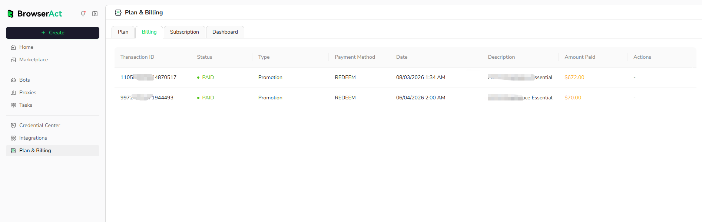

Use the Billing page to review transaction records associated with your BrowserAct account.

## Open Billing History

1. Open `Plan & Billing` from the BrowserAct dashboard.
2. Select the `Billing` tab.

## Review a Transaction

Each transaction can include:

- **Transaction ID:** The identifier for the transaction
- **Status:** The current payment status
- **Type:** The transaction category
- **Payment Method:** How the transaction was completed
- **Date:** When the transaction was recorded
- **Description:** The plan, promotion, or purchase associated with it
- **Amount Paid:** The amount charged for the transaction
- **Actions:** Available transaction actions when supported

Keep the Transaction ID when contacting BrowserAct Support about a payment.

## Request an Invoice

Create a ticket in the [BrowserAct Discord community](https://discord.com/invite/UpnCKd7GaU), or email [support@browseract.com](mailto:support@browseract.com). Include the Transaction ID and the order information needed to identify the purchase.

Do not send full payment-card details, passwords, or other sensitive account information.
