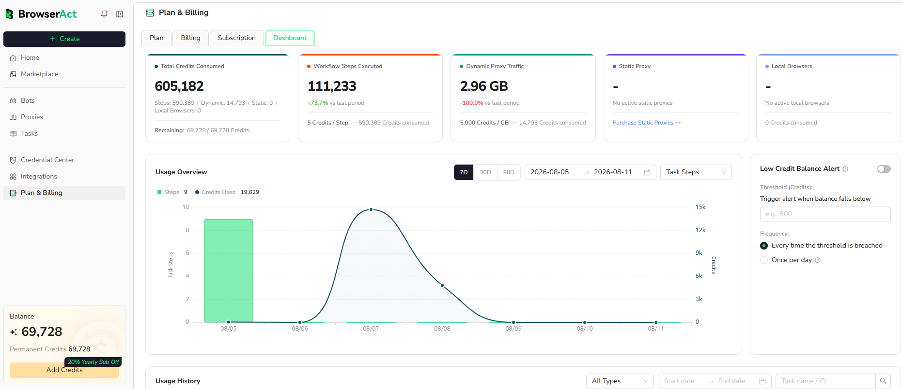
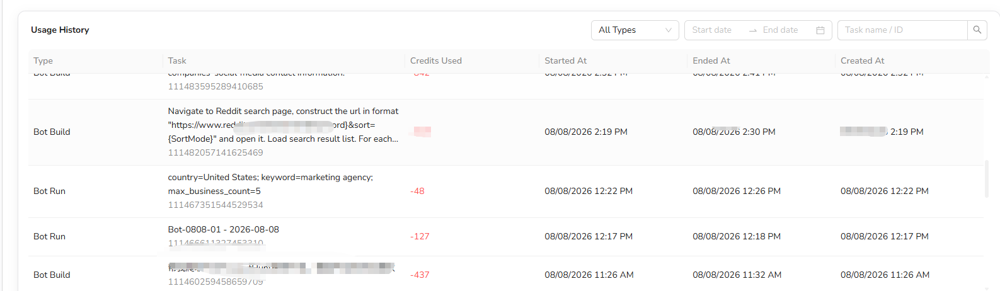
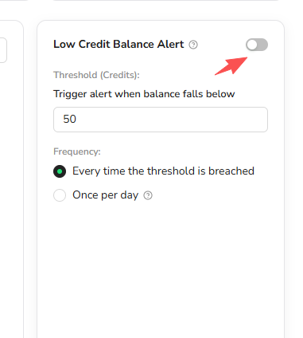

Use the Billing Dashboard to review how credits are consumed across BrowserAct services.

## Open the Billing Dashboard

1. Open `Plan & Billing` from the BrowserAct dashboard.
2. Select the `Dashboard` tab.

## Review Credit Consumption

The summary shows the current usage categories available for the account:

- **Total Credits Consumed:** Total usage and the remaining credit balance
- **Workflow Steps Executed:** Workflow Built steps and the related credit consumption
- **Dynamic Proxy Traffic:** Bandwidth used and the corresponding credits
- **Static Proxy:** Active Static Proxy usage when applicable
- **Local Browsers:** Active local fingerprint browsers and the related credits

## Filter the Usage Overview

Use the controls above the chart to:

- View the last 7, 30, or 90 days
- Select a custom date range
- Change the usage category shown in the chart

The chart compares activity volume with the credits consumed during the selected period.

## Review Usage History

Use `Usage History` to inspect individual credit consumption records.

Each record can show:

- **Type:** The activity that consumed credits, such as Bot Build or Bot Run
- **Task:** The request summary, Task name, and Task ID
- **Credits Used:** Credits deducted by the activity
- **Started At:** When execution started
- **Ended At:** When execution finished
- **Created At:** When the Task was created

Filter the records by usage type, date range, or Task name and ID.

## Set a Low-Balance Alert

Turn on `Low Credit Balance Alert` when you want BrowserAct to notify you after the balance falls below a specified threshold.

1. Enable the alert.
2. Enter the credit threshold.
3. Choose whether to notify every time the threshold is breached or once per day.

Review the current interface for the available delivery channel and alert status.
