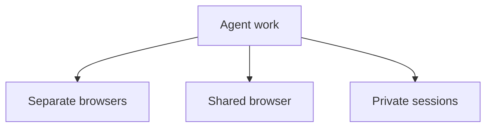
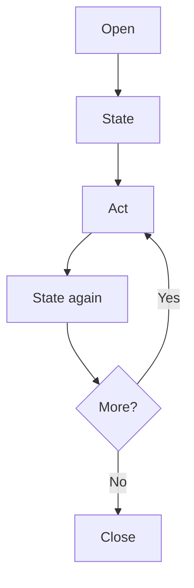

Browser-act separates **identity** from **work**:

- A **browser** is an identity: cookies, profile, fingerprint, proxy, and description.
- A **session** is a workspace: one task's current page, tabs, state, and command flow.

This model lets agents run multiple tasks without mixing state.

## Concurrency models

<div style={{ display: "flex", justifyContent: "center" }}>



</div>

| Model | Isolation level | Shared state | Best for |
| --- | --- | --- | --- |
| Cross-browser parallelism | Browser identity | Nothing by default | Multiple accounts, regions, or identities |
| Multiple sessions on one browser | Session workspace | Cookies and login state | Parallel tasks on the same account |
| Stealth privacy sessions | Fresh profile per session | Nothing persistent | One-off public data collection |

## Cross-browser parallelism

Each browser has independent cookies, fingerprints, and proxy settings.

```bash
browser-act --session account-a browser open <browser_a_id> https://example.com
browser-act --session account-b browser open <browser_b_id> https://example.com
```

Session names must be globally unique. Use names that describe the task and identity.

## Multiple sessions on one browser

Use multiple sessions when tasks should share the same login state but run independently:

```bash
browser-act --session inbox-check browser open <browser_id> https://example.com/inbox
browser-act --session report-export browser open <browser_id> https://example.com/reports
```

Both sessions share the browser's cookies and profile, but navigation and current page state are separate.

## Privacy mode sessions

For stealth browsers with `--private true`, each session starts with a fresh fingerprint and empty profile:

```bash
browser-act browser create \
  --type stealth \
  --name "private-runner" \
  --desc "Fresh identity for one-off collection" \
  --private true
```

This avoids residue between jobs. The trade-off is that login state is not kept.

## Session lifecycle

<div style={{ display: "flex", justifyContent: "center" }}>



</div>

Rules:

- A session belongs to the agent or task that created it.
- A session is tied to one browser.
- One browser can have multiple sessions.
- Session names must be unique.
- Idle sessions may be reclaimed automatically after a period of inactivity.

List and close sessions:

```bash
browser-act session list
browser-act session close <session_name>
```

## Commands that do not need a session

These commands operate outside a browser workspace:

- `browser list`
- `browser create`
- `browser update`
- `browser delete`
- `browser regions`
- `browser list-profiles`
- `session list`
- `auth login`, `auth poll`, `auth set`, `auth clear`
- `get-skills`
- `report-log`
- `feedback`
- `stealth-extract`

## Best practices

> [!TIP]
> Use descriptive session names such as `pricing-us`, `login-check`, or `report-export`. Close sessions when the task is complete.

<Columns cols={2}>
  <Card title="Shared account work" icon="copy">
    Use multiple sessions when tasks should share one browser identity and login state.
  </Card>
  <Card title="Separate identities" icon="fingerprint">
    Use separate browsers when tasks need separate accounts, regions, cookies, or proxies.
  </Card>
  <Card title="One-off jobs" icon="shield">
    Use privacy mode for work that should leave no persistent profile state.
  </Card>
  <Card title="Readable ownership" icon="tag">
    Name sessions by task and identity so agents and humans can understand what each session is doing.
  </Card>
</Columns>

## Learn more

<Columns cols={3}>
  <Card title="Browser Modes" icon="panel-top" href="/agent-cli/browser-modes" cta="Choose identity">
    Choose the right browser identity before running parallel work.
  </Card>
  <Card title="Designed for Agents" icon="brain-circuit" href="/agent-cli/designed-for-agents" cta="Understand rules">
    See how naming, selection, and safety rules help agents operate cleanly.
  </Card>
  <Card title="Command Reference" icon="terminal" href="/agent-cli/command-reference" cta="Find commands">
    Look up browser and session management commands.
  </Card>
</Columns>
