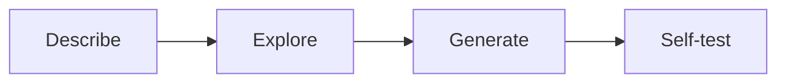

Skill Forge is an extension built on Browser-act CLI. It lets AI agents explore a website once, then generate a reusable skill for repeated extraction or automation.

## The problem

Without a reusable skill, an agent has to rediscover the same website every time:

- paths change between runs
- failure modes differ
- scaling is unreliable
- token usage grows with every call

Skill Forge separates **exploration** from **reuse**.

> [!NOTE]
> Explore once. Generate a deployable skill package. Reuse the same stable path for hundreds or thousands of inputs.

## Installation

Skill Forge is separate from the Browser-act entry Skill. Install the entry Skill and CLI first.

Ask your agent:

```text
Install browser-act-skill-forge.
Skill URL: https://github.com/browser-act/skills/tree/main/browser-act-skill-forge
After installation, verify that it is available.
```

Requirements:

- [Browser-act CLI installed](/agent-cli/installation)
- Browser-act entry Skill installed
- A task that can be described in natural language

## Four-step pipeline

<div style={{ display: "flex", justifyContent: "center" }}>



</div>

| Step | What happens |
| --- | --- |
| 01. Describe | Tell the agent what data or action you need |
| 02. Explore | The agent looks for an API-first path, then falls back to DOM automation if needed |
| 03. Generate | The agent creates a parameterized skill package |
| 04. Self-test | The generated skill is tested and repaired until it works |

### 01. Describe the task

Use natural language:

```text
Extract job title, company, salary, and URL from LinkedIn jobs.
I will later run this for 300 keywords.
```

### 02. Explore API-first, DOM fallback

Skill Forge prefers stable paths:

| Priority | Strategy | Stability |
| --- | --- | --- |
| 1 | API-first through network capture | More stable when backend contracts stay the same |
| 2 | DOM fallback through browser automation | Works when no useful API path is available |

### 03. Generate a parameterized skill

Business variables become CLI parameters instead of hard-coded values:

```bash
job-search --keyword "designer" --location "Berlin" --limit 100
```

Typical output:

- `SKILL.md`
- executable script
- usage instructions
- self-test evidence

### 04. Self-test and repair

The generated skill should be tested end to end. When the target site changes, the agent can re-explore and update the skill instead of rediscovering the workflow on every run.

## Business value

<Columns cols={2}>
  <Card title="For individual developers" icon="user">
    Pay the exploration cost once, reuse the generated path for many inputs, and re-explore only when the site changes.
  </Card>
  <Card title="For teams" icon="users">
    Move repeatable scraping work from one-off scripts toward generated, tested, reusable capabilities.
  </Card>
</Columns>

Traditional model:

```text
request -> engineer writes scraper -> test -> deploy -> maintain
```

Skill Forge model:

```text
request -> agent explores -> skill generated -> self-test -> deploy
```

The engineering work shifts from writing every scraper by hand to maintaining a system that lets agents generate reusable capabilities.

## Use cases

<Columns cols={2}>
  <Card title="Batch data collection" icon="list">
    Run one pattern across many keywords, regions, or categories.
  </Card>
  <Card title="Cross-site price comparison" icon="scale">
    Generate skills for multiple sites and normalize output.
  </Card>
  <Card title="Periodic monitoring" icon="activity">
    Track price, inventory, or listing changes.
  </Card>
  <Card title="Internal processes" icon="briefcase-business">
    Wrap repeated browser operations into reusable skills.
  </Card>
</Columns>

## Entry Skill vs. Skill Forge

| Area | Browser-act entry Skill | Skill Forge |
| --- | --- | --- |
| Role | Gives the agent Browser-act CLI capability | Generates reusable task-specific skills |
| Required | Yes | Optional |
| Usage | Agent operates the browser in real time | Agent explores once and reuses generated skill |
| Token cost | Paid during each live exploration | Concentrated during skill generation |

Browser-act gives agents the ability to act. Skill Forge helps agents turn a successful action path into a reusable skill.

## Learn more

<Columns cols={3}>
  <Card title="Installation" icon="download" href="/agent-cli/installation" cta="Install first">
    Install the base CLI and entry Skill before using Skill Forge.
  </Card>
  <Card title="Anti-detection & Blocking" icon="shield-check" href="/agent-cli/anti-detection-blocking" cta="Explore reliably">
    Use blocking tools during exploration when a site challenges automation.
  </Card>
  <Card title="Designed for Agents" icon="brain-circuit" href="/agent-cli/designed-for-agents" cta="Use state well">
    Use network capture and semantic descriptions effectively.
  </Card>
</Columns>
