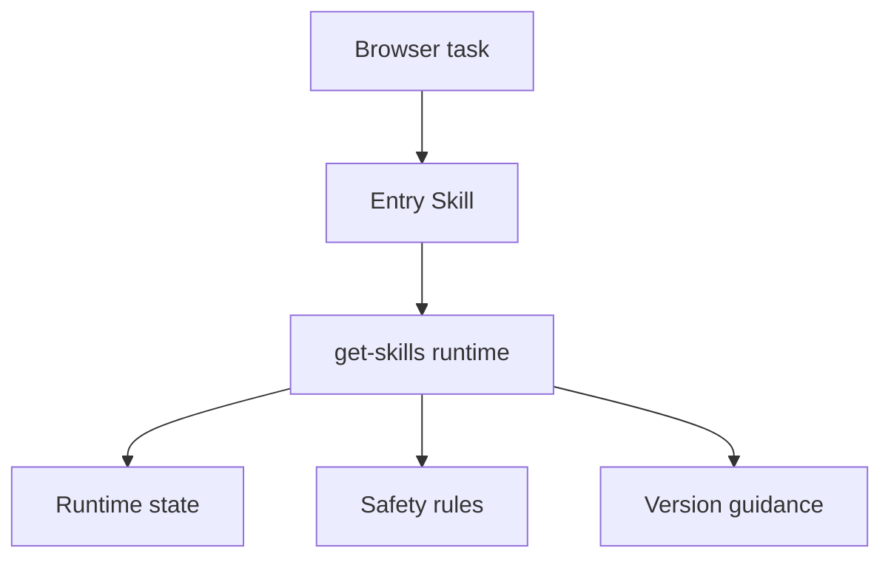
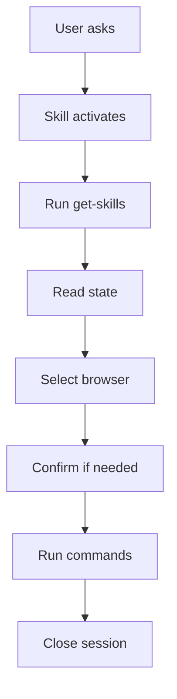

Browser-act uses a two-layer Skill model:

1. The **entry Skill** makes the agent aware that Browser-act exists.
2. The **`get-skills` runtime** returns current environment state, command guidance, and dynamic instructions.

## Install the entry Skill

Ask your agent:

```text
Install the browser-act Skill from:
https://github.com/browser-act/skills/tree/main/browser-act
```

After installation, the agent can recognize Browser-act tasks and call `get-skills` before using the CLI.

## Two layers

<div style={{ display: "flex", justifyContent: "center" }}>



</div>

## Layer 1: entry Skill

The installed Skill file is intentionally small. It:

- triggers agent awareness
- contains activation language
- tells the agent to load runtime content through `get-skills`
- changes rarely

## Layer 2: `get-skills`

The first command for a Browser-act task should be:

```bash
browser-act get-skills core --skill-version <version>
```

The output gives the agent:

- CLI and API key status
- available browsers and descriptions
- active sessions
- core command guidance
- dynamic instructions for the current environment

## Topics

<Columns cols={3}>
  <Card title="core" icon="route">
    `get-skills core --skill-version <v>` returns the core workflow, commands, browser state, and safety rules for most tasks.
  </Card>
  <Card title="advanced" icon="settings">
    `get-skills advanced` returns proxy, profile import, privacy mode, and advanced browser setup guidance.
  </Card>
  <Card title="main" icon="refresh-cw">
    `get-skills main` returns the latest Skill content when a version mismatch is detected.
  </Card>
</Columns>

## Progressive loading

> [!TIP]
> Most tasks only need `get-skills core`. Load advanced topics only when the task requires them. This keeps the agent context focused and reduces irrelevant instructions.

## Version compatibility

The `--skill-version` parameter lets the CLI detect mismatches:

```bash
browser-act get-skills core --skill-version 2.0.2
```

When versions are incompatible, the output includes direct upgrade guidance:

<Columns cols={2}>
  <Card title="CLI too old" icon="terminal">
    Run `uv tool upgrade browser-act-cli`.
  </Card>
  <Card title="Skill too old" icon="download">
    Run `browser-act get-skills main`.
  </Card>
</Columns>

## Dynamic instructions

`get-skills` adjusts guidance based on the current state:

| Situation | Instruction returned |
| --- | --- |
| Multiple browsers exist | Choose by `desc` match or ask the user |
| Active sessions exist | Respect session ownership and naming |
| API key is missing | Avoid stealth-only features or guide authentication |
| Sensitive browser is selected | Ask before opening a `confirm_before_use` browser |

## Agent workflow

<div style={{ display: "flex", justifyContent: "center" }}>



</div>

## Agent compatibility

Browser-act can work with agents that can:

1. load Skill files
2. run shell commands
3. read text output

Known compatible environments include Claude Code, GitHub Copilot, Cursor, Windsurf, Gemini CLI, OpenCode, Codex, and similar agent runtimes.

## Learn more

<Columns cols={3}>
  <Card title="Quick Start" icon="rocket" href="/agent-cli/quick-start" cta="Run a loop">
    Run the first Browser-act automation loop.
  </Card>
  <Card title="Command Reference" icon="terminal" href="/agent-cli/command-reference" cta="Open index">
    Open the full command index.
  </Card>
  <Card title="Skill Forge" icon="hammer" href="/agent-cli/skill-forge" cta="Generate skills">
    Generate reusable task-specific skills.
  </Card>
</Columns>
