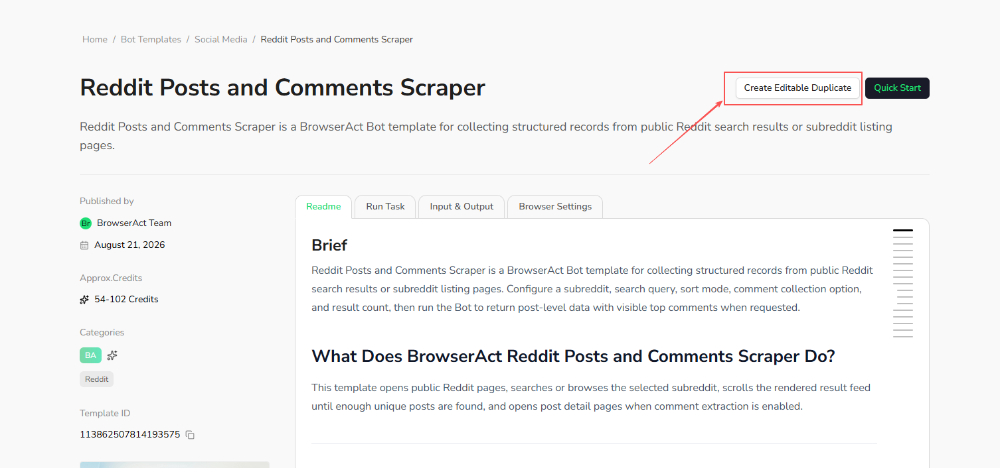

Use `Create Editable Duplicate` when a template is a useful starting point but you need to change its extraction fields, logic, or target scenario.

## Create the Duplicate

1. Open the [BrowserAct Template Marketplace](https://www.browseract.com/template?co-from=bot-template-help-center).
2. Select the template you want to customize.
3. Select `Create Editable Duplicate`.
4. Open the new Agent Built Bot from your `Bots` list and make the required changes.

The duplicate is an independent Agent Built Bot. Changes to your duplicate do not affect the official template, and later updates to the official template are not applied automatically to the duplicate.
