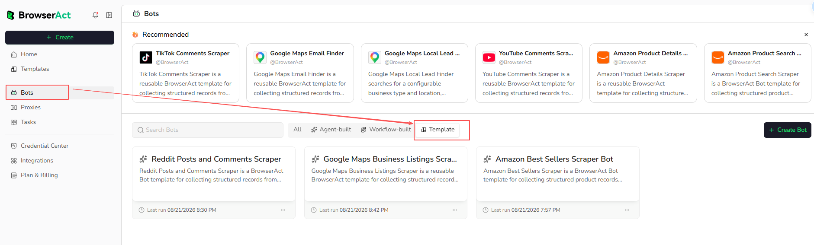

After you run a template, BrowserAct creates or reuses a template Bot in your account. You can return to it without reopening the Template Marketplace.

## Find Template Bots

1. Open `Bots`.
2. Select the `Template` filter.
3. Open the template Bot you want to manage.

From the template Bot, you can:

- Enter new runtime inputs and run it again
- Review previous Tasks from `History`
- Adjust supported browser and proxy settings from `Browser Settings`
- Create an editable duplicate when you need to change the Bot itself

The official template structure remains read-only. BrowserAct template updates preserve the existing template Bot's settings and History.
