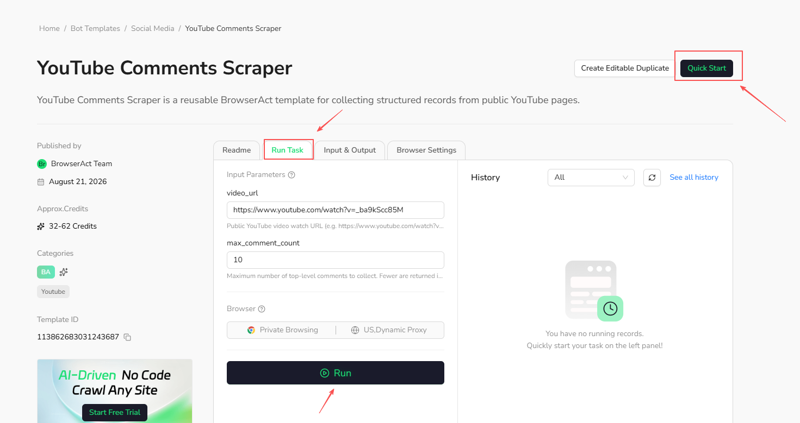

Use a template when the existing scenario already matches what you want to extract or automate.

## Run the Template

1. Open the [BrowserAct Template Marketplace](https://www.browseract.com/template?co-from=bot-template-help-center).
2. Select the template you want to use.
3. Select `Quick Start`, or open the `Run Task` tab.
4. Enter the required inputs and select `Run`.
5. Review the structured result after the Task completes.

Each run creates a Task record. You can review the result from the Bot's `History` tab or from the account-level `Tasks` page.

Running a template usually costs less than building a Bot from scratch because the Bot structure has already been prepared. Actual credit usage may vary by website, input size, browser settings, and runtime behavior.
