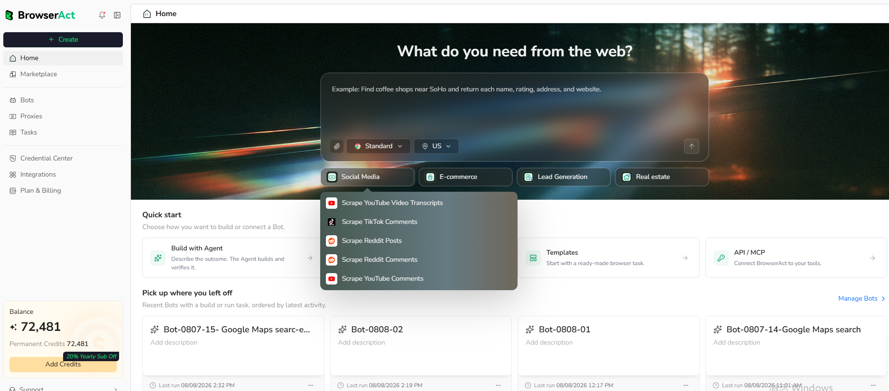
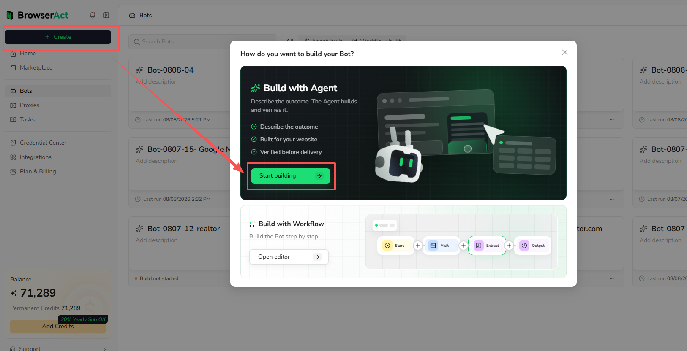
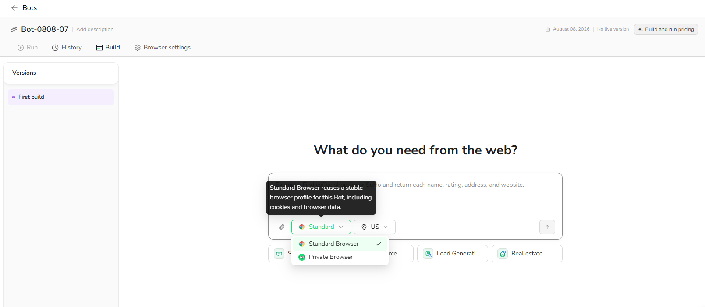

Agent Built creates a Bot from a natural-language data request. It is the simplest option when you know what data you need but do not want to build the browser steps manually.

## Step 1: Describe What You Need

On Home, start Agent Built in either of these ways:

- Select one of the configured prompt templates below the prompt box.
- Enter your own request directly in the prompt box.



You can also select `Create`, then choose `Start building` under `Build with Agent`.



For a clear request, include:

- **Website:** Where BrowserAct should start
- **Records:** What items or pages to collect
- **Conditions:** Keywords, categories, locations, filters, or date ranges
- **Fields:** The exact data to return
- **Limit:** How many results you need
- **Inputs:** Values you want to change in future runs

Example:

```text
Go to the Amazon Best Sellers page and collect the top 20 products
from the Clothing, Shoes & Jewelry department. Return the rank,
product name, price, rating, review count, image URL, and product URL.
```

> **Tip:** Specific requests produce better Bots. Include the target page, record limit, conditions, and required fields.

### Choose Browser Mode and Proxy Region

Before submitting the request, select the browser mode and proxy region that fit the target website and task.



Submit the request when it describes the result you expect.

### Optional Build Support

Agent Built includes optional tools that can provide more context or help you start faster:

- Start from an available prompt template and edit it for your target website.
- Upload supported files, such as PDF, DOCX, or XLSX, as context for the build.
- Preview or download validation data retained during the build when available.

Supported file formats, file limits, and validation-data availability depend on the current product configuration.

## Step 2: Let BrowserAct Build and Test the Bot

BrowserAct interprets the request, explores the live website, builds the extraction path, and tests the requested result.

After you submit the request, the Agent analyzes it and asks you to confirm the target before continuing. Review and confirm the target within 60 minutes.

If information is missing, BrowserAct may ask you to clarify the website, conditions, fields, or expected output. Reply in the same build conversation.

For supported login or verification steps during building, BrowserAct may provide a controlled assistance path. Complete it only for pages you are authorized to access.

## Step 3: Run the Bot and Get Results

When the build is complete, select `Run` at the bottom of the Build page. Review the resulting Task and structured records after the run finishes.

Verify source URLs and any missing fields before exporting or integrating the result.

To change the fields, inputs, pages, or navigation behavior later, see [Improve a Bot](../improve/improve-a-bot.md).
