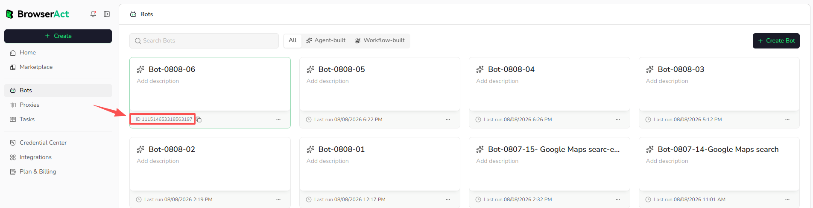
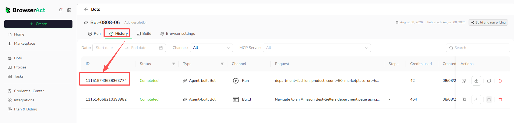

A Bot is a reusable Cloud automation for a repeatable web data task.

Both Agent Built and Workflow Built create Bots. After construction, the automation is managed, identified, and run as a Bot.

## How Bots Work

Building defines and tests the Bot's extraction logic. Running uses a specific set of inputs to produce a structured result.

Each build, test, or run creates a separate Task. A Task records the operation and its available status, inputs, result, and usage information.

## Bot Inputs

Inputs are values that can change between runs, such as:

- URL
- Keyword
- Country or region
- Category
- Date range
- Record limit

Default values make a Bot easier to test, but users can replace them when running the Bot.

## Bot Outputs

Outputs are the structured fields returned by the Bot, such as product name, price, rating, source URL, or publish date.

For list extraction, the result contains one structured record per item. A missing field should remain empty rather than being inferred from unrelated page content.

## Bot ID

Every Bot has a Bot ID. You can find it in either of these ways:

- Open `Bots` and move the pointer over the Bot card to reveal its ID and copy button.
- Open the Bot and find its ID in the Bot page URL in the browser address bar.



Use the Bot ID when an integration needs to identify which Bot to run. BrowserAct Cloud uses Bot and Bot ID consistently as the user-facing object and identifier.

## Task ID

Every Task has a unique Task ID. It identifies one specific build, test, or run.

Open the Bot, select `History`, and find the Task ID in the `ID` column. You can also view it in the Task details.



Use the Task ID when reviewing a specific execution or sharing an issue with BrowserAct Support. A Task ID does not replace the Bot ID used to identify which Bot to run.

## Bot and Task

```text
Bot = reusable automation
Task = one build, test, or run record
Result = structured output from a completed run
```

A Bot can have many Tasks. Deleting or changing a Bot does not turn its previous Tasks into new Bots.
