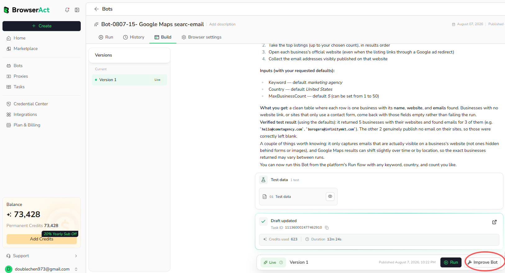
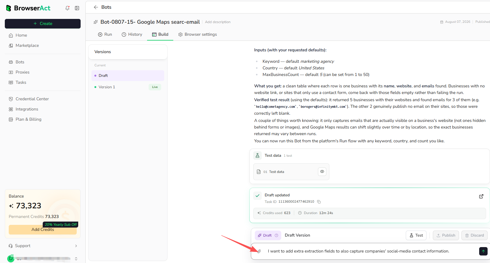
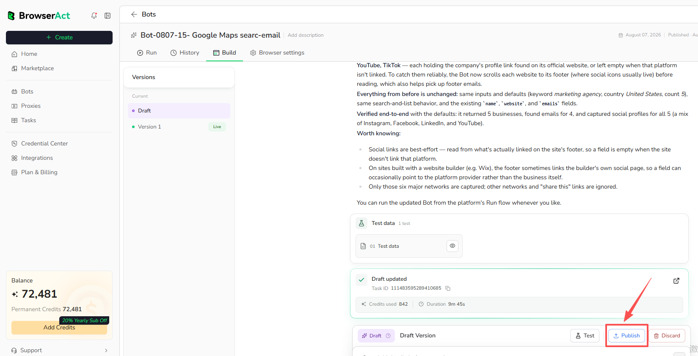
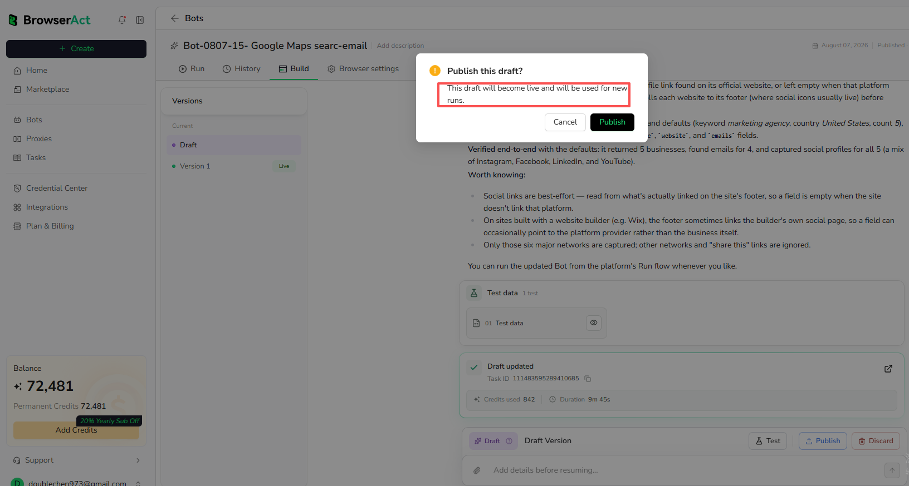
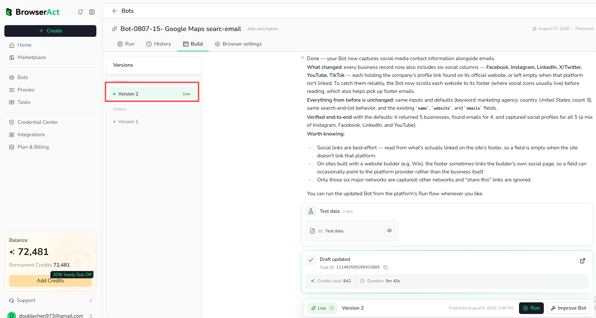

> **Availability:** `Improve Bot` is available only for Agent Built Bots. It is not available for Workflow Built Bots. To update a Workflow Built Bot, open its Workflow Builder and modify the relevant nodes.

Use `Improve Bot` when an existing Agent Built Bot no longer fully matches what you need. For example, you may want to:

- Add new extraction fields, such as social-media links or contact details
- Rename, remove, or change existing output fields
- Change filters, limits, keywords, or other configurable inputs
- Adjust the pages or navigation path the Bot uses
- Update the Bot after the target website or required result has changed

Describe the change in natural language instead of rebuilding the Bot from the beginning. BrowserAct builds and tests the update as a draft, while the current `Live` version remains available for runs. The update is used by future runs only after you review and publish the draft.

## 1. Open Build and Select Improve Bot

1. Open the `Bots` menu and select the Agent Built Bot you want to modify.
2. Open the `Build` tab.
3. Review the current `Live` version and select `Improve Bot`.

The Build page also lists previous published versions for reference.

## 2. Describe the Change

Enter the specific improvement you need and send the request. Include the fields, behavior, or conditions that should change.

Example:

> I want to add extra extraction fields to also capture companies' social-media contact information.

BrowserAct creates a draft, updates the Bot, and tests the new behavior. The existing `Live` version is not replaced during this step.

## 3. Review and Publish the Draft

Review the updated behavior and test data. When the result is ready:

1. Select `Publish` on the draft.
2. Confirm the publication.

The published draft becomes the new `Live` version and is used for new runs. The previous version moves to History and remains available for review.

## 4. Run the Updated Bot

Open the `Run` tab. The Run page automatically displays and uses the latest `Live` version; the version is not selectable on this page.

Review the updated inputs and browser settings, then select `Run`. Future runs use the newly published version until another draft is published.

