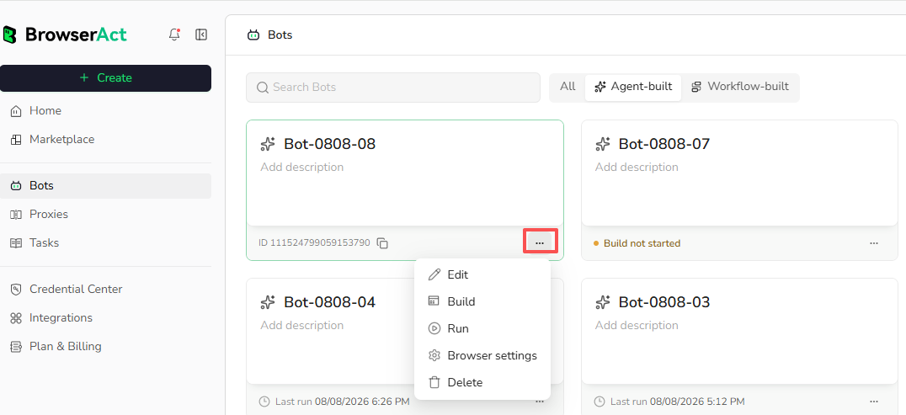

Open `Bots` to find and manage the Bots in your BrowserAct account.

## Browse, Search, and Filter

Use the search field to find a Bot by name. Select `All`, `Agent-built`, or `Workflow-built` to filter the Bot list by build method.

Each Bot card shows its name, description when available, Bot ID, and available last-run information.

## Copy a Bot ID

Use the copy control beside the Bot ID. The Bot ID identifies the Bot in supported integrations and developer workflows.

## Bot Actions

Select the three-dot menu in the lower-right corner of a Bot card to access the available actions:

- `Edit`: update available Bot details.
- `Build`: open the Bot's build experience.
- `Run`: start the Bot with the required inputs.
- `Browser Settings`: change the browser and network environment used by future tasks.
- `Delete`: permanently remove the Bot when deletion is allowed.

## View the Last Run

The Bot card shows the available last-run time. Open Tasks for detailed status, inputs, results, failure information, and usage records.

## Delete a Bot

Delete only when the Bot is no longer needed. Confirm the exact Bot before deleting it.
