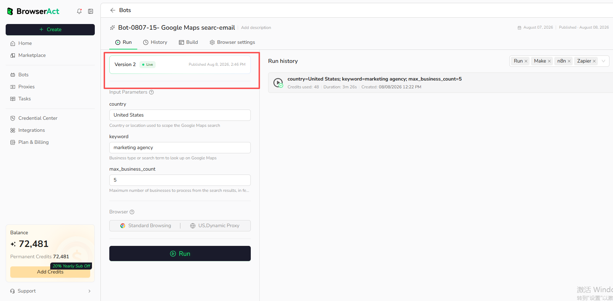

Run a published Agent Built Bot using its latest `Live` version.

## Before You Run

Confirm that:

- The Bot has a published version marked `Live`.
- The browser and proxy settings match the target website.
- Required Bot inputs have valid values.
- Your account has enough credits for the run.

## Start a Run

1. Open `Bots` and select the Agent Built Bot.
2. Open the `Run` tab.
3. Enter the required input values.
4. Review the browser configuration.
5. Select `Run`.

The Run page automatically uses the latest published `Live` version. The version displayed on this page is not selectable.

The run creates a Task. The latest run appears in the Run history area with available duration, creation time, and credit usage.

## Runs Started by Integrations

The Run history area can distinguish available channels such as direct Run, Make, n8n, and Zapier. The displayed channels depend on how the Bot was started.

Select `See all history` or open the Bot's `History` tab to review more records.
