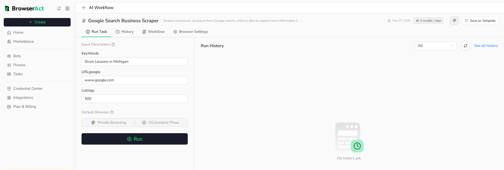

Run a published Workflow Built Bot from its `Run Task` page.

## Before You Run

Confirm that:

- The Workflow Built Bot has been published.
- Required input parameters have valid values.
- The default browser and proxy settings match the target website.
- Your account has enough credits for the run.

## Start a Run

1. Open `Bots` and select the Workflow Built Bot.
2. Open the `Run Task` tab.
3. Enter the required input parameters.
4. Review the default browser and proxy settings.
5. Select `Run`.

The run creates a Task. Recent runs appear in the Run History area on the same page.

Select `See all history` or open the Bot's `History` tab to review more records.
