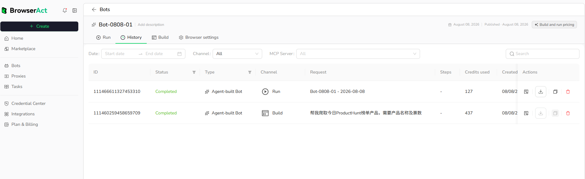

Run History records the build and run activity associated with a Bot.

## Open Run History

1. Open `Bots` and select the Bot.
2. Select the `History` tab.

You can also select `See all history` from the Run tab after starting a Bot.

## Find a Record

Use the available controls to narrow the list:

- Date range
- Channel
- Additional channel filters shown by the current product
- Search

## Information in Each Record

A history row can show:

- Task ID
- Status
- Bot type
- Channel, such as Run or Build
- Request or run name
- Steps when available
- Credits used
- Creation time
- Available record actions

## Review a Completed Run

Locate the record by date, channel, or search. Confirm that its status is `Completed`, then use the available action to inspect or download the result.

Build records and Run records may appear in the same History view. Use the Channel filter to separate them when needed.
