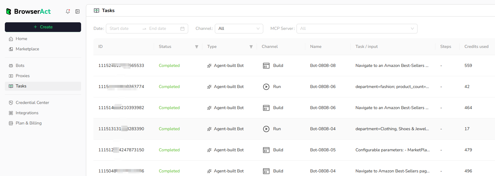

Each Bot build or run creates a Task. Open `Tasks` to review records across all Bots. If you only want to view the task records for a specific Bot, you can also open that Bot and select `History`.

## Filter Tasks

Use the available filters to narrow the task list:

- Date range
- Channel
- MCP Server when applicable
- Type
- Search when available

## Task Information

Each row can show:

- Task ID
- Status
- Bot type
- Channel, such as `Build` or `Run`
- Bot name
- Task request or input
- Steps when available
- Credits used

## Review a Task

Select a Task or use its available actions to review task details and results. The available actions depend on the task type and status.

Use the Task ID when locating a specific record or contacting BrowserAct Support.
