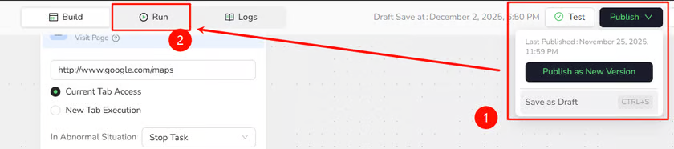
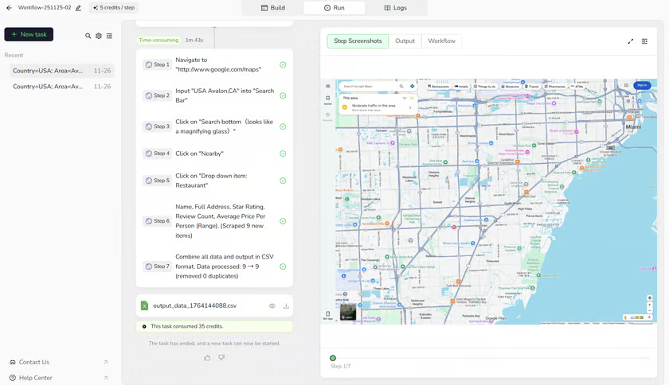

## Video Tutorial

[](https://www.youtube.com/watch?v=8fYWAQhm3QU)

[Watch **Build Your First Workflow in 5 Minutes** on YouTube](https://www.youtube.com/watch?v=8fYWAQhm3QU).

## 1. Create a Workflow Built Bot

1. Select `Create`.
2. Under `Build with Workflow`, select `Open editor`.


3. Enter an `AI Workflow Name` and an optional description.
4. Select `Create` to open the Workflow Builder.


---

## 2. Build the Workflow: Google Maps Example

A Workflow connects nodes that represent the actions you would perform on a real website. For example, use a **Visit Page** node when you need to open a page, and use a **Click Element** node when you need to click a button.

This tutorial uses Google Maps to demonstrate the complete process. The Bot searches for restaurants in a selected location and extracts structured data from the results.

**Inputs**

- **Country:** e.g., `USA`
- **Area:** e.g., `Avalon, CA`

**Browser Actions**

1. Open `https://www.google.com/maps`
2. Search `{Country} {Area}`
3. Click search icon
4. Click **Nearby**
5. Click **Restaurant**
6. Extract list data

**Output**

A CSV file containing:

- `name`
- `full_address`
- `star_rating`
- `review_count`
- `average_price_per_person_range`

_All steps below are performed on the Workflow Build page._

### Step 1 - Start Node: Define Input Parameters

1. On the canvas, click the **Start** node.
2. In **Input Parameters**, add:
   - **Name:** `Country` | **Default Value:** `USA`
   - **Name:** `Area` | **Default Value:** `Avalon, CA`


### Step 2 - Visit Page: Open Google Maps

1. Click **\+** on the canvas (or right-click) and choose [**Visit Page**](/bot/workflow-built/node-types/visit-node).
2. Connect it after **Start**.
3. Set URL to:

   ```
   https://www.google.com/maps
   
   ```


### Step 3 - Input Text: Search for the Location

1. Add an [**Input Text**](/bot/workflow-built/node-types/input-text-node) node and connect it after **Visit Page**.
2. In the page preview/selector, target the **top search bar**.
3. In Text to Input, enter: Country Area

   (This references the Start parameters).


### Step 4 - Click Element: Navigate to Restaurants

Use one or more [**Click Element**](/bot/workflow-built/node-types/click-element-node) nodes to perform these three clicks in order:

1. **Search:** Click the magnifying-glass icon.
2. **Nearby:** Click the `Nearby` button.
3. **Restaurant:** Click the `Restaurant` category.


### Step 5 - Extract Data: Scrape the Restaurant List

1. Add an [**Extract Data**](/bot/workflow-built/node-types/extract-data-node) node after the last Click Element node.
2. In the left restaurant list, select **one full restaurant item** as the sample.
3. Configure fields to extract:
   - `name`
   - `full_address`
   - `star_rating`
   - `review_count`
   - `average_price_per_person_range`


---

## 3. Publish & Run

Before executing the workflow, ensure your latest changes are saved and versioned.

1. **Publish Version:** Click the **Publish** button (top-right corner) and select **Publish as New Version** to save your current configuration.
2. **Enter Run Mode:** Click the **Run** tab (located next to the _Build_ tab).



3. **Set Parameters:**
   - Country: `USA`
   - Area: `Avalon, CA`
4. **Execute:** Click **Start Run** and watch the nodes execute one by one.

You’re done when:

1. All steps show **Succeeded / ✔**.
2. The run result shows a **downloadable CSV file**.
3. The CSV contains rows like:

Code snippet

```
name,full_address,star_rating,review_count,average_price_per_person_range
Bluewater Avalon,306 Crescent Ave,4.3,2342,$30–50
Buffalo Nickel Inc,57 Pebbly Beach Rd,4.6,646,$20–30
...
```



---

## 4. Common Roadblocks (Quick Fixes)

- **CSV is empty or has very few rows:**
  - Check the sample in [**Extract Data**](/bot/workflow-built/node-types/extract-data-node): it should be a full list item, not a tiny sub-element.
  - **Wait for load:** Add a short [wait](/bot/workflow-built/node-types/wait-node) before Extract Data if the list loads slowly.
- **Click Element does nothing:**
  - Re-select the actual clickable element (button/text) in the [Click Element node](/bot/workflow-built/node-types/click-element-node).
  - Confirm node order: Search → Nearby → Restaurant.
- **Run error and not sure why:**
  - Check URL in Visit Page is exactly `https://www.google.com/maps`.
  - Ensure Run parameters (Country/Area) are filled.
  - Ensure no node has missing config ([Click Element](/bot/workflow-built/node-types/click-element-node), etc.).

### Need Help?

If the issue continues, [contact BrowserAct Support](../../support/contact-support.mdx) or create a ticket in [Discord](https://discord.com/invite/UpnCKd7GaU). Include:

- A short description of your goal
- A screenshot of the error
- The Task ID

---

## Next Steps

Run the Bot again with different input values to confirm that the workflow can be reused for other locations.

For example:

| Country | Area |
| --- | --- |
| USA | New York |
| Japan | Shibuya |

Once the workflow runs successfully with new inputs, continue to [Node Types](./node-types/index.md) to learn how to build other browser interactions, or see [Run a Workflow Built Bot](../run/run-workflow-built-bot.md) for more ways to run and review a Bot.
