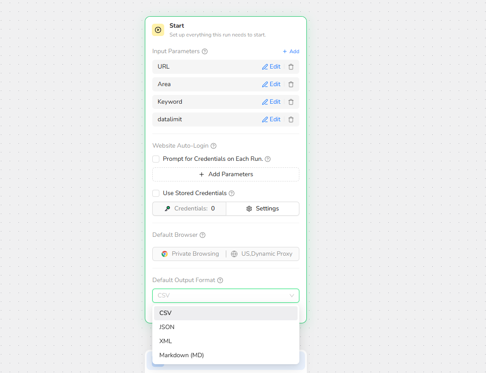

Overview

The Start node defines the settings used when the Workflow Built Bot runs. Every workflow begins with one Start node.

**Use Cases**

- Defining input parameters that users provide before a run.
- Configuring credential prompts or stored credentials.
- Selecting the default browser mode and proxy region.
- Selecting the default result format.
- Converting the structured result to a downloadable file.

**Core Capabilities**

- Defines the workflow input parameters.
- Configures supported website auto-login options.
- Sets the default browser mode and proxy region.
- Sets the default output format for the workflow result.
- Supports converting the result to a file format.

**Configuration Steps**

1. Open the **Start** node at the beginning of the workflow.
2. Add the input parameters required for each run.
3. Configure website auto-login when the workflow requires an authenticated page.
4. Select the default browser mode and proxy region.
5. Select the **Default Output Format**.
6. Enable **Convert to file format** when the result should be returned as a downloadable file.

**Recommendations**

- Use clear input parameter names and descriptions.
- Select the browser mode and proxy region that match the target website.
- Use JSON for API and automation integrations, or CSV for spreadsheet use.
- Test the output before publishing to confirm that all required extraction fields are returned.
