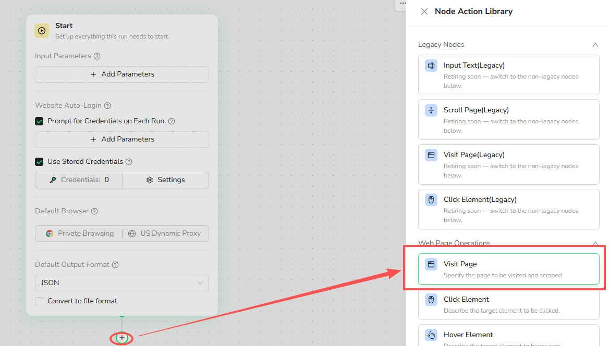
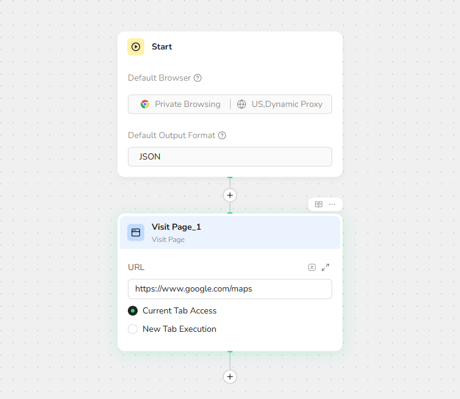
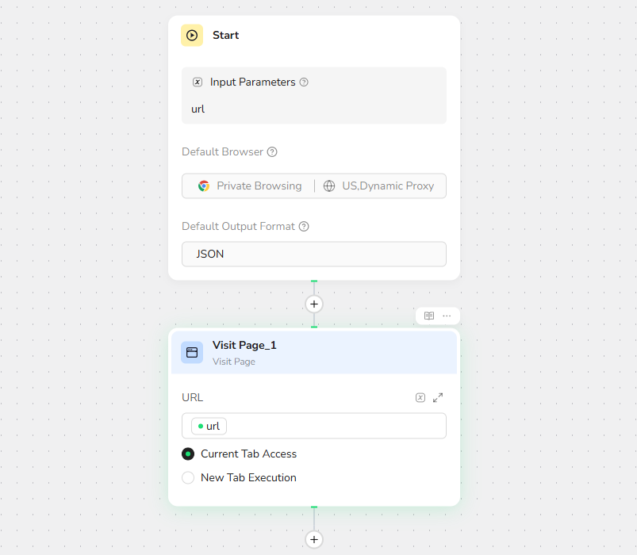

# Visit Page

## Overview

The **Visit Page** node opens a target webpage in the browser. It is commonly placed after the **Start** node and before clicks, text input, scrolling, or data extraction.



## Use Cases

- Open a product list, search result, forum, or other target page.
- Start a monitoring or data extraction workflow from a fixed URL.
- Open a URL supplied through a Bot input or an earlier node.
- Open a page in a new tab while keeping the current page available.

## Core Capabilities

- Open a complete URL in the current tab or a new tab.
- Reference an input parameter or a value from an earlier node.
- Configure how the workflow responds if the page cannot be opened.

## Configuration Steps

1. Select the `+` below a node and choose **Visit Page**.
2. Enter a complete URL beginning with `http://` or `https://`.
3. Select **Current Tab Access** or **New Tab Execution**.
4. Configure the failure behavior when needed.



Example:

```text
https://www.google.com/maps
```

### Use a Dynamic URL

The URL can reference an input parameter or a value produced by an earlier node. Use a dynamic URL when the destination changes between runs or while processing a list of URLs.



For multiple URLs, place **Visit Page** inside the appropriate **Loop** or **Loop List** flow.

## Recommendations

- Use one **Visit Page** node for each page-opening action.
- Use a direct URL when the workflow always starts from the same page.
- Open a new tab when the original page must remain available.
- Add interaction or extraction nodes after the page has loaded.
- Test the workflow before publishing the Bot.
