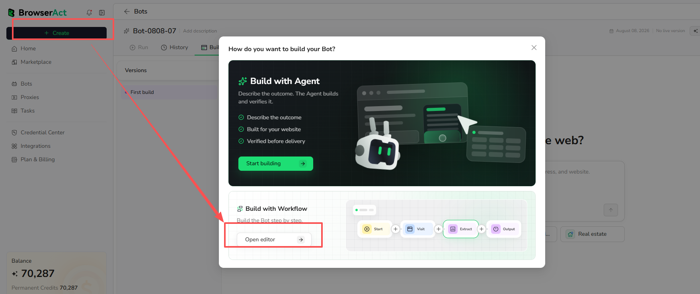
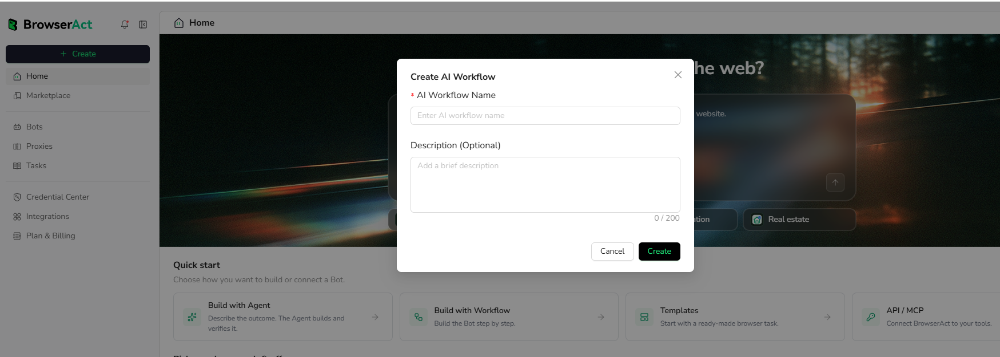
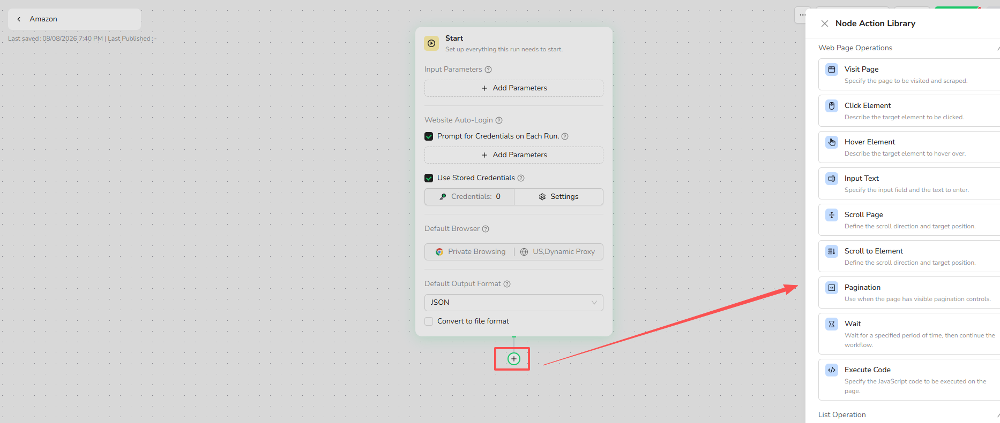
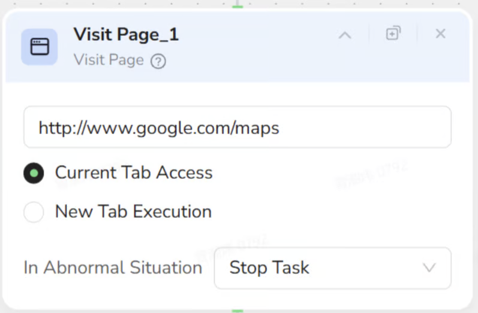
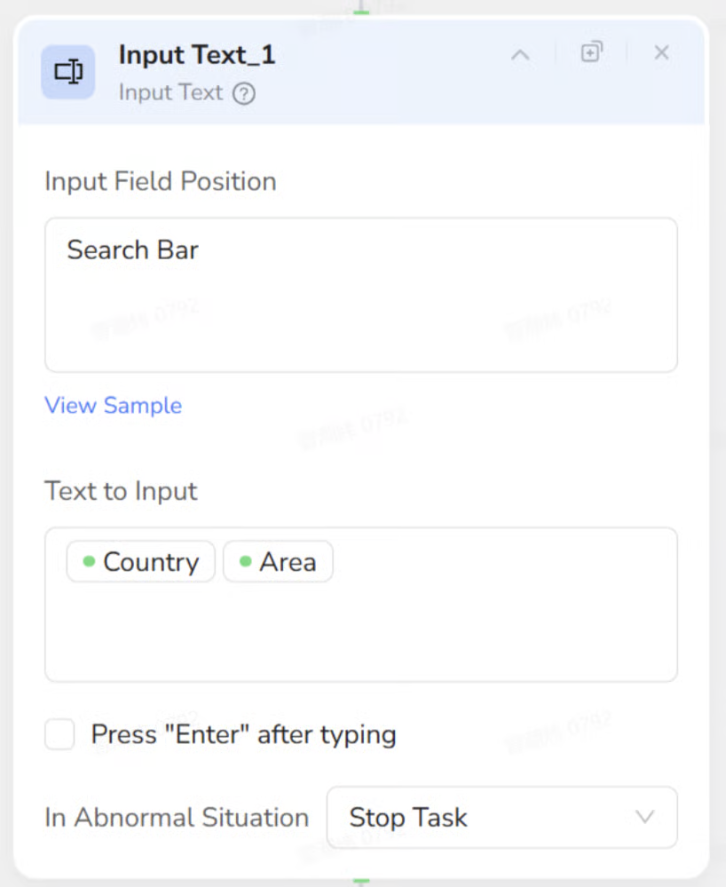
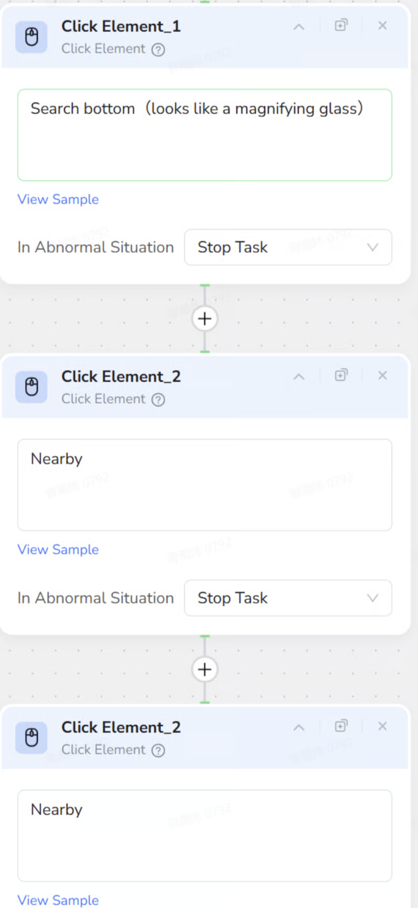
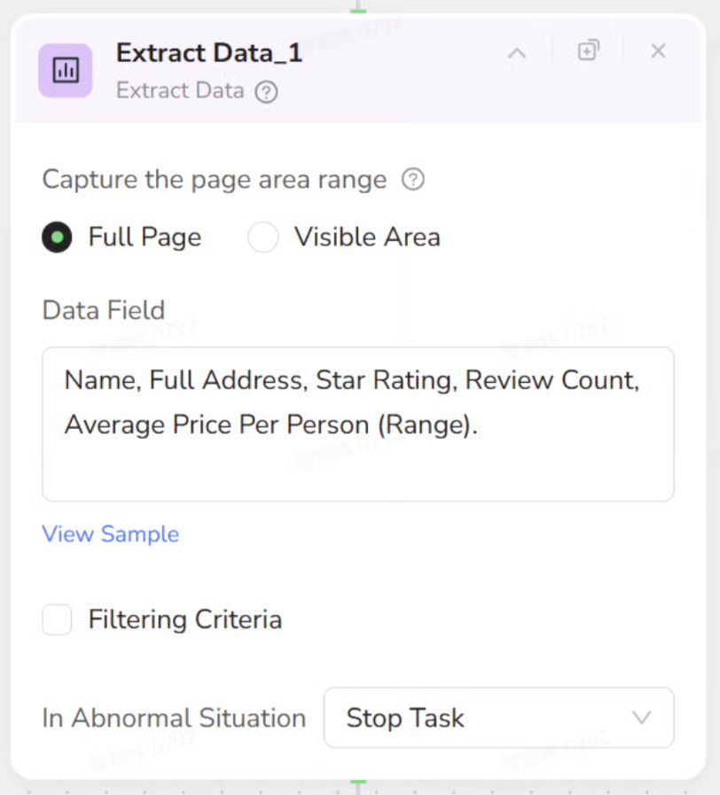

Workflow Built lets you create a Bot by connecting and configuring nodes in a visual builder. Each node represents a browser action, condition, data operation, or output step.

Use Workflow Built when you know the steps the browser should follow and want direct control over the order, conditions, loops, and extracted fields.

## How Workflow Built Works

### 1. Open the Workflow Builder

Select `Create`, find `Build with Workflow`, and select `Open editor`.

### 2. Create the Workflow

Enter an `AI Workflow Name`, add an optional description, and select `Create`.

### 3. Configure the Start Node

Use the Start node to configure the settings the Bot needs before its first action:

- Input parameters
- Supported website credentials or login prompts
- Default browser mode and proxy region
- Default output format

### 4. Add and Configure Nodes

Select the `+` below a node to open the Node Action Library. Add the browser actions, data operations, conditions, loops, and output nodes required for the task.

Connect the nodes in execution order and configure each node before testing the Bot.

## Mapping Manual Actions to Nodes

To automate a web task, map each manual browser interaction to a BrowserAct node:

| Manual interaction | BrowserAct node |
| --- | --- |
| Open a URL | [**Visit Page**](./node-types/visit-node.mdx) |
| Type text into a field | [**Input Text**](./node-types/input-text-node.mdx) |
| Click a button or link | [**Click Element**](./node-types/click-element-node.mdx) |
| Scroll the viewport | [**Scroll Page**](./node-types/scroll-page-node.mdx) |
| Navigate to the next page | [**Pagination**](./node-types/pagination-node.mdx) |
| Copy text or data | [**Extract Data**](./node-types/extract-data-node.mdx) |
| Repeat actions for a list | [**Loop**](./node-types/loop-node.mdx) |

**Key distinction:** A Workflow defines **what** the business goal is, while Nodes define **how** the browser executes each step technically.

### Node Examples

**Visit Page** opens the target URL.

**Input Text** enters values into a selected field.

**Click Element** reproduces button and link clicks in the required order.

**Extract Data** collects the required fields from the page.

### 5. Test, Publish, and Run

Test the workflow and correct any failed steps. When the result is ready, publish the Bot and run it with the required inputs.

After publishing, the automation is managed and run as a Bot. New runs use its latest published version.

## Common Building Blocks

- **Start:** Define input parameters used by the Bot.
- **Browser nodes:** Visit pages, click elements, enter text, scroll, wait, and manage tabs.
- **Logic nodes:** Add conditions, loops, list iteration, and pagination.
- **Extraction nodes:** Extract page data or data from the current list item.
- **Start:** Define the Bot inputs, browser settings, and default output format.

See **Node Types** for the configuration and usage of every available node.

## Workflow Built or Agent Built?

- Choose **Workflow Built** when you want to define and control each step in the visual builder.
- Choose **Agent Built** when you want to describe the data you need and let BrowserAct explore and build the extraction path.

Both methods create Bots that can be managed, published, and run from BrowserAct Cloud.

## Next Step

Continue to [Build Your First Workflow Built Bot](./build-your-first-bot.mdx).
