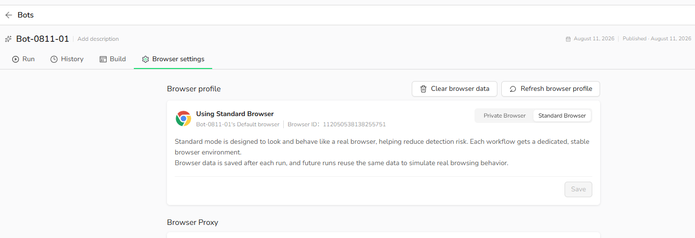

Open any Bot and select `Browser settings` to choose its browser mode.

## Standard Browser

### Positioning

Designed to simulate long-term, stable real-user behavior.

### How It Works

- Each Bot is assigned a fixed Browser ID.
- Cookies, cache, and browsing history are stored between runs.
- The same browser environment is reused across runs.

### Use Standard Browser When

- The Bot needs to sign in to an account and remain signed in, such as a dashboard, admin panel, or social platform.
- The same Bot runs repeatedly over time.
- The website should recognize a consistent returning browser.
- Session stability is more important than starting with a clean browser each time.

### Not Recommended For

- High-frequency account switching
- One-time public-page extraction that does not require a persistent session

## Private Browser

### Positioning

Designed for isolated, temporary browser sessions.

### How It Works

- Each run starts with a clean browser instance.
- Cookies, cache, and browsing history are not retained.
- Browser data is removed after the Task completes.

### Use Private Browser When

- The Bot accesses public pages that do not require login, such as search results, product listings, or content pages.
- Each run should be isolated from previous runs.
- You want to avoid carrying browser state between runs.
- You are testing scenarios where session persistence is unnecessary.

> **Switching modes:** When you switch from Standard Browser to Private Browser, BrowserAct warns that historical browser data will be cleared.
