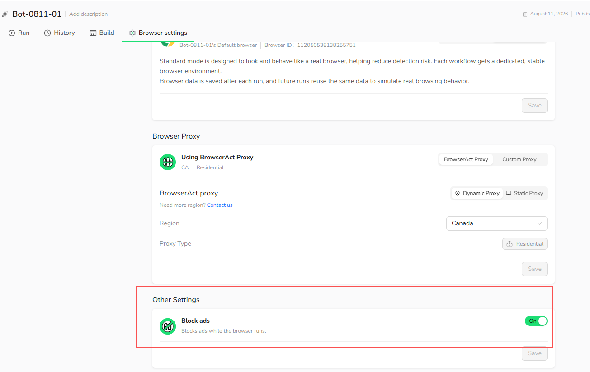
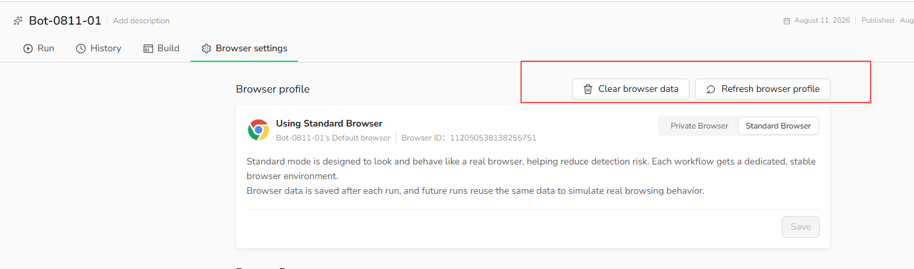

Open any Bot and select `Browser settings` to manage these options.

## Block Ads

Enable `Block ads` to block ads while the browser runs. This can reduce distractions and improve page loading when advertisements are not required for the Bot.

1. Open `Browser settings`.
2. Scroll to `Other Settings`.
3. Turn on `Block ads`.
4. Select `Save`.

Keep this option off when the Bot needs to interact with or inspect advertising content.

## Browser Maintenance

The following maintenance actions apply to a `Standard Browser`, which retains browser data between runs.

### Clear Browser Data

Select `Clear browser data` to remove the Standard Browser's saved cookies, cache, browsing history, and session data. The Browser ID and browser profile remain unchanged.

Use this action when a saved session is outdated, the website is loading stale data, or you want the Bot to start with a clean browser state.

Clearing browser data signs the Bot out of websites that relied on the stored session. This action is unavailable while a Task is running.

### Refresh Browser Profile

Select `Refresh browser profile` to replace the current browser profile. Websites may recognize the refreshed profile as a new browser or device.

Use this action when clearing browser data does not resolve a browser-profile issue. You may need to sign in again after refreshing the profile.

