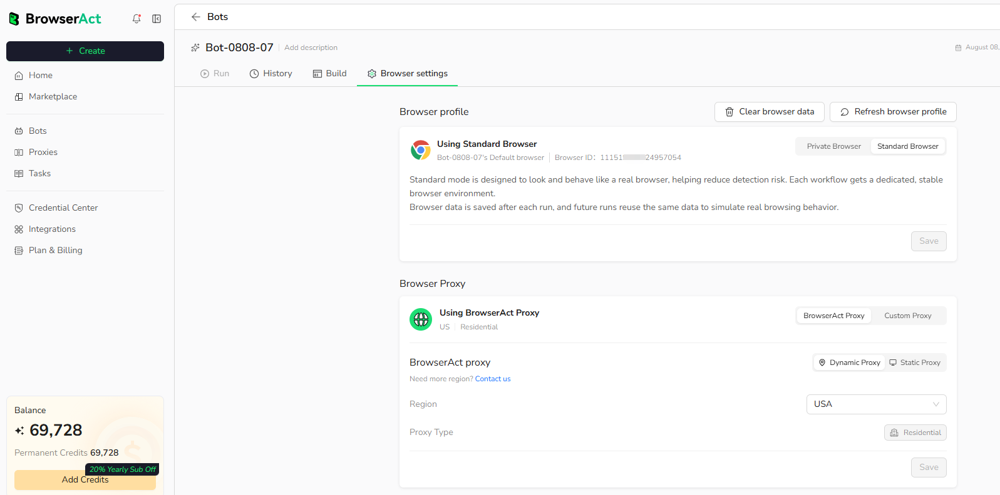
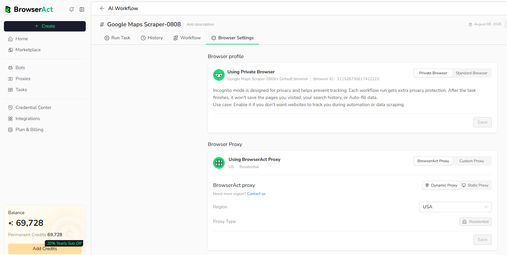

Use Browser Settings to choose the browser identity and network route used by a Bot.

## 1. Open Browser Settings

1. Open `Bots` and select any Bot.
2. Select `Browser settings`.

The entry is the same for Agent Built and Workflow Built Bots.

## 2. Choose Browser Mode

Select the browser mode that fits the target website and task.

### Standard Browser

Standard Browsing reuses a stable browser profile, including supported cookies and browser data.

**Best for:**

- Websites that require a consistent browser identity.
- Repeated tasks that depend on an authenticated session.
- Bots that need supported browser data to persist between runs.

### Private Browser

Private Browsing starts with a clean browser environment and does not retain browser data after the run.

**Best for:**

- Public pages that do not require login.
- Tasks that should start with a clean browser environment.
- Runs that do not need cookies or session data to persist.

## 3. Configure Proxy

Choose the network route used by the Bot.

### BrowserAct Proxy

- BrowserAct Proxy supports **Dynamic Proxy** and **Static Proxy**.
- Select the proxy mode and available region required by the Bot.
- Use a Dynamic Proxy when the task requires a rotating residential network route.
- Use a Static Proxy when the task requires a stable IP.

### Custom Proxy

Use Custom Proxy when you have your own supported proxy service. Enter the required endpoint and authentication information, then use the available proxy check before running the Bot.

## 4. Save Your Settings

Select `Save` to apply the browser and proxy configuration. Unsaved changes do not affect future tasks.

## Next Step

Choose the browser identity and proxy route that match the website, save the settings, and test the complete Bot flow. For a detailed comparison, continue to [Browser Modes & Profiles](./browser-modes-profiles.mdx).
