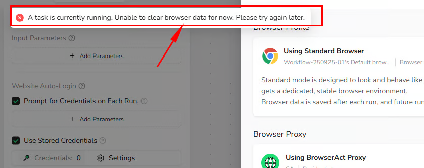
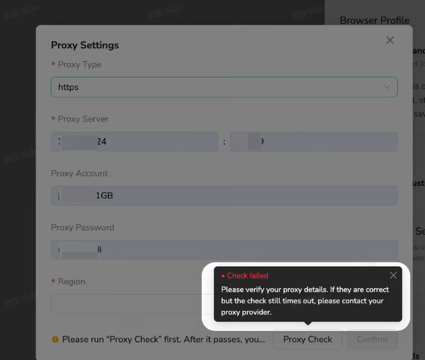
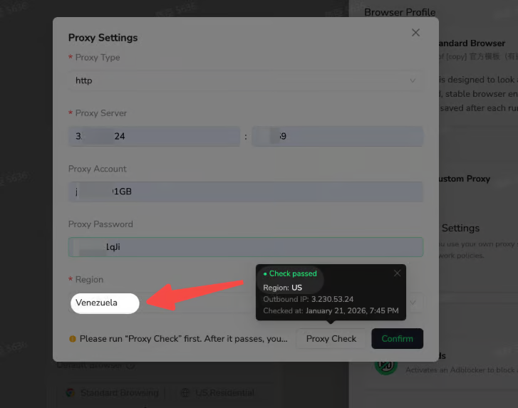

## "Clear Browser Data" Is Disabled

Browser data cannot be cleared while a Task is running.

Wait for the Task to finish, or stop it when appropriate. Then return to `Browser settings` and select `Clear browser data` again.

## Proxy Check Failed

A Custom Proxy check can fail when:

- The server address or port is incorrect.
- The selected protocol does not match the proxy.
- The username or password is incorrect.
- The proxy endpoint is unavailable or has timed out.

Review the proxy details and run `Check proxy` again. If the information is correct but the check continues to time out, contact your proxy provider.

## Detected Proxy Region Does Not Match the Selected Region

After a successful proxy check, BrowserAct displays the detected region and outbound IP address.

If the detected region differs from the region selected in `Proxy settings`, choose the region that matches the proxy's actual outbound location, then confirm and save the configuration.

## Frequent Login or Verification Prompts

This can happen when a login-based Bot uses `Private Browser` or its browser profile changes frequently.

- Switch to `Standard Browser` to retain browser state between runs.
- Use a BrowserAct Static Residential Proxy when the website expects a consistent IP.
- Avoid clearing browser data or refreshing the browser profile unless necessary.
