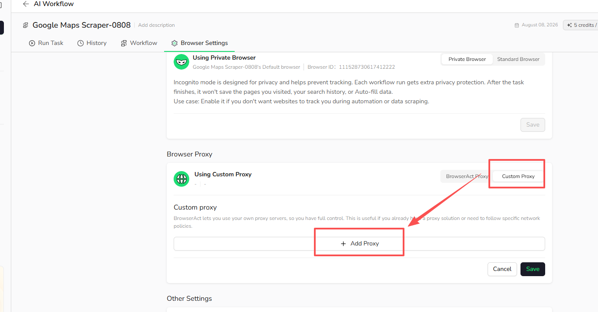
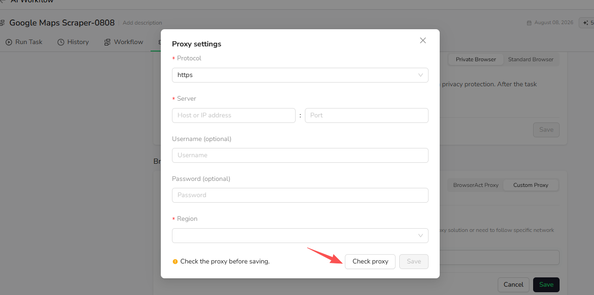

Use Custom Proxy when you already have a proxy provider or need a network route managed outside BrowserAct.

## Video Tutorial

[Watch **Configure HTTP and SOCKS5 Custom Proxies** on YouTube](https://www.youtube.com/watch?v=ptAwhQ8aH08).

## Add a Custom Proxy

1. Open `Bots` and select the Bot.
2. Select `Browser settings`.
3. Under **Browser Proxy**, select `Custom Proxy`.
4. Select `Add Proxy`.

5. Choose a supported protocol and enter the server address and port.
6. Enter the username and password when required by your proxy provider.
7. Select the proxy region.
8. Select `Check proxy` to validate the connection.
9. After the check succeeds, select `Save`.

`Check proxy` verifies that the proxy is reachable before the Bot uses it.

## Manage Custom Proxies

After a Custom Proxy is added, you can select it for the Bot or edit and delete it from the Custom Proxy list.

BrowserAct does not manage the availability, location, rotation policy, or billing of proxies supplied by third-party providers.
