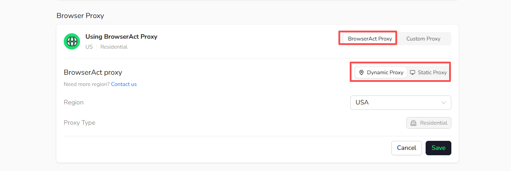

BrowserAct supports three proxy options for cloud Bots.

| Proxy option | How it works | Best for |
| --- | --- | --- |
| Dynamic Proxy | Uses the BrowserAct residential proxy network and can rotate the IP between runs. | Public web extraction, monitoring, and region-specific results |
| Static Proxy | Assigns a purchased fixed IP to the Bot. | Account-based tasks, stable sessions, and fixed-IP workflows |
| Custom Proxy | Connects a proxy supplied by your own provider. | Existing proxy infrastructure or provider-specific requirements |

## Open Proxy Settings

Open `Bots`, select a Bot, and then select `Browser settings`. Under **Browser Proxy**, choose `BrowserAct Proxy` or `Custom Proxy`.

When using BrowserAct Proxy, select either `Dynamic Proxy` or `Static Proxy`.

## Choose a Proxy

- Use **Static Proxy** when the Bot needs to keep a stable IP.
- Use **Dynamic Proxy** when IP rotation and regional access matter more than a fixed identity.
- Use **Custom Proxy** when you want to connect a proxy from your own provider.

See **Best Practices** for common browser and proxy combinations.
