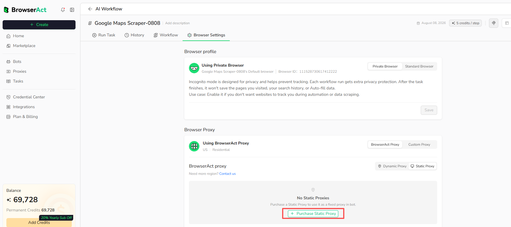
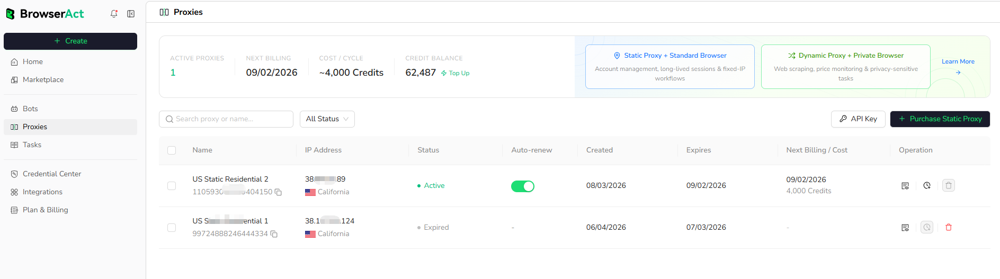
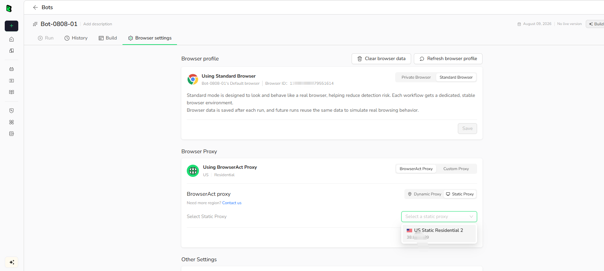

A Static Proxy provides a fixed IP for tasks that need a stable network identity, such as account-based workflows and long-lived sessions.

## Video Tutorial

[](https://www.youtube.com/watch?v=_QygzxJR4E4)

[Watch **Instagram Data Scraping with Static IP Proxies** on YouTube](https://www.youtube.com/watch?v=_QygzxJR4E4).

## Purchase a Static Proxy

You can start a purchase from either location:

- Open `Proxies`, then select `Purchase Static Proxy`.
- Open a Bot, select `Browser settings` > `BrowserAct Proxy` > `Static Proxy`, then select `Purchase Static Proxy` when no suitable proxy is available.



Complete the purchase options shown in the dashboard. Static Proxy availability and cost depend on the selected location and current plan terms.

## View and Manage Static Proxies

Open `Proxies` to view purchased proxies across your account.

The list shows the proxy name and ID, IP address and location, status, auto-renew setting, creation and expiration dates, and the next billing information. You can search proxies and filter them by status.



Review the status before assigning a proxy to a Bot. An expired proxy cannot provide the same fixed-IP continuity as an active proxy.

## Use a Static Proxy with a Cloud Bot

1. Open `Bots` and select the Bot.
2. Select `Browser settings`.
3. Under **Browser Proxy**, select `BrowserAct Proxy` > `Static Proxy`.
4. Choose an active Static Proxy from the list.
5. Select `Save`.



For account-based tasks, pair the Static Proxy with **Standard Browser** to maintain a stable browser profile and IP.

## Use a Static Proxy with Agent CLI

Use the Static Proxy ID shown on the `Proxies` page.

Create a browser with a Static Proxy:

```bash
browser-act browser create --type stealth --name "<browser-name>" --desc "<browser-description>" --static-proxy <static-proxy-id>
```

Assign a Static Proxy to an existing browser:

```bash
browser-act browser update <browser-id> --static-proxy <static-proxy-id>
```

Remove the assigned proxy:

```bash
browser-act browser update <browser-id> --no-proxy
```

Use the Static Proxy for an extraction:

```bash
browser-act stealth-extract "<url>" --static-proxy <static-proxy-id>
```

Keep the same Static Proxy assigned when a website or account expects a consistent IP.
