Credential Center stores supported website login information for Workflow Built Bots. It can reduce repeated manual login steps when a workflow accesses an authorized page.

> **Note:** Credential Center is currently available for Workflow Built Bots only. Credential hosting for Agent Built Bots is coming soon.

Credentials are encrypted and are not exposed to the platform, third parties, or language models without your authorization.

## Add a Credential

1. Open `Credential Center`.
2. Select `Add`.

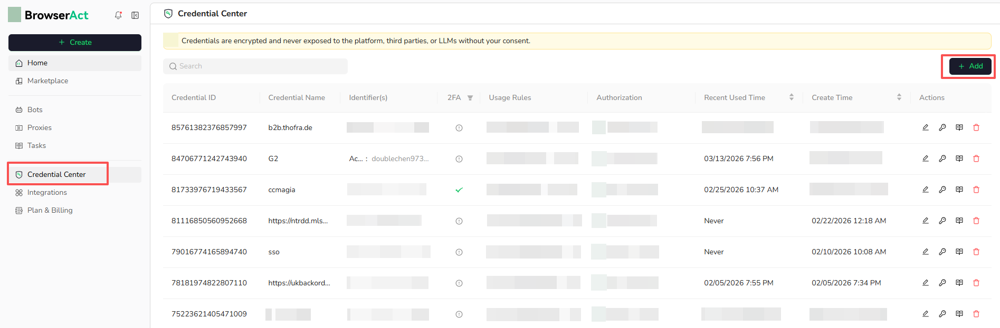

3. Enter a clear **Credentials Name**, such as `Google Account` or `Instagram Account`.
4. Under **Identifier(s)**, enter the same login fields used by the target website. For example, use `Email`, `Username`, `Account`, or `Tenant ID` as the key and enter the corresponding value.
5. Select `Add Another Identifier` when the website requires more than one identifier.
6. Enter the password.
7. Add an **Authenticator App Key** when the website uses supported TOTP-based 2FA. You can enter the secret key or use the QR Code option available in the form.
8. Describe where the credential should be used in **Usage Rule**, such as `Use for all Google logins`.
9. Select `Confirm`.

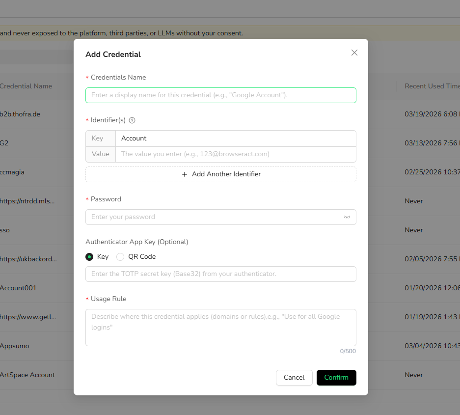

### Login with Two Fields

When the website asks for one account identifier and one password, add one Identifier and the Password. For example, an Instagram login can use the phone number, username, or email as the Identifier.

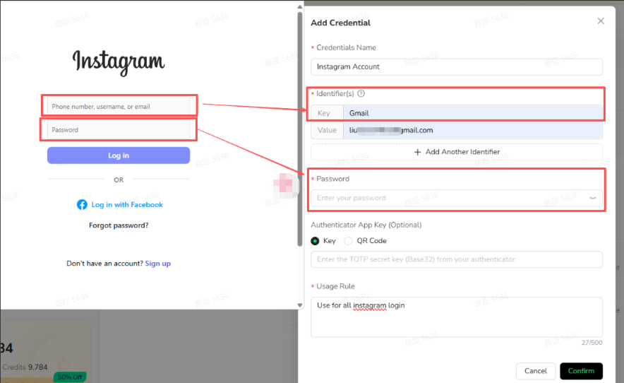

### Login with Three Fields

When the website asks for two account identifiers and one password, select `Add Another Identifier` and map both fields. For example, an AWS IAM login can use `Account ID`, `IAM username`, and `Password`.

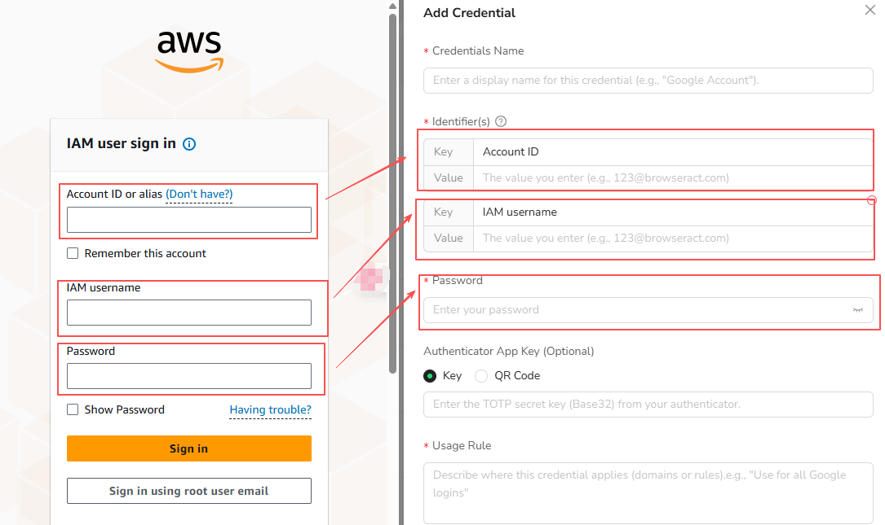

## Authorize a Workflow Built Bot

A saved credential is not automatically available to every Workflow Built Bot. Authorize only the workflows that need it.

### From Credential Center

1. Open `Credential Center` and locate the credential.
2. Select the authorization icon in the credential's **Actions** column.

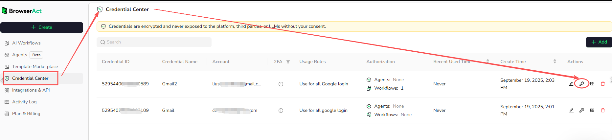

3. Under **Authorized Workflows**, select `Specific`.
4. Open `Not Authorized` and select the Workflow Built Bot that may use the credential.
5. Authorize the workflow and confirm the change.

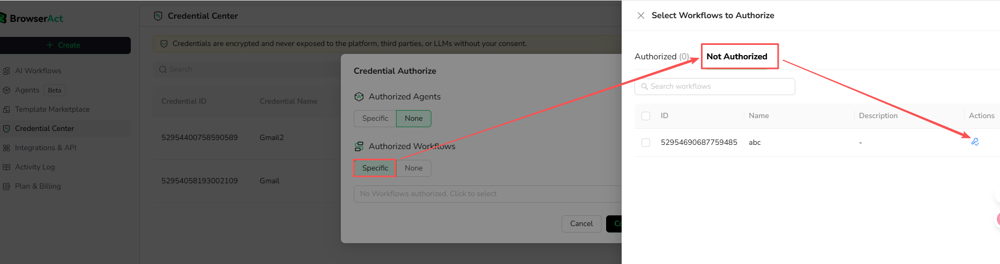

### From the Start Node

1. Open the Workflow Built Bot and select `Workflow`.
2. Open the `Start` node.
3. Enable `Use Stored Credentials`.
4. Select `Settings` and choose an authorized credential.

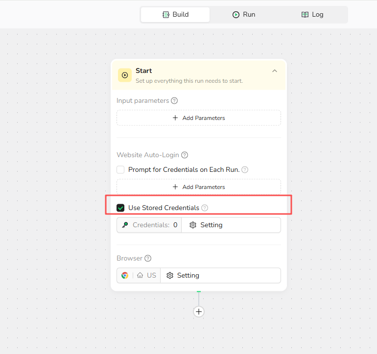

## Choose an Auto-Login Option

Configure Website Auto-Login in the `Start` node.

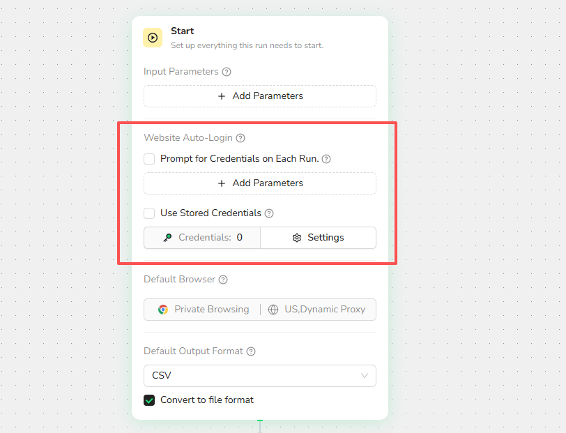

### Prompt for Credentials on Each Run

Use this option when the workflow needs different login information for each run. The user enters the required credential values when starting the task.

### Use Stored Credentials

Use this option for repeated or unattended runs. The workflow uses an authorized credential from Credential Center without asking the user to enter it again.

## Supported 2FA

Authenticator-app 2FA using a TOTP secret key or QR code is optional and can be added when the target website supports this setup.

Email and SMS verification should not be treated as supported stored-credential methods unless they are shown as available in the current product.

## Manage Credentials

### Edit a Credential

Select the edit icon in the credential's **Actions** column. Update the credential name, account information, password, Authenticator App Key, or Usage Rule, and then select `Confirm`.

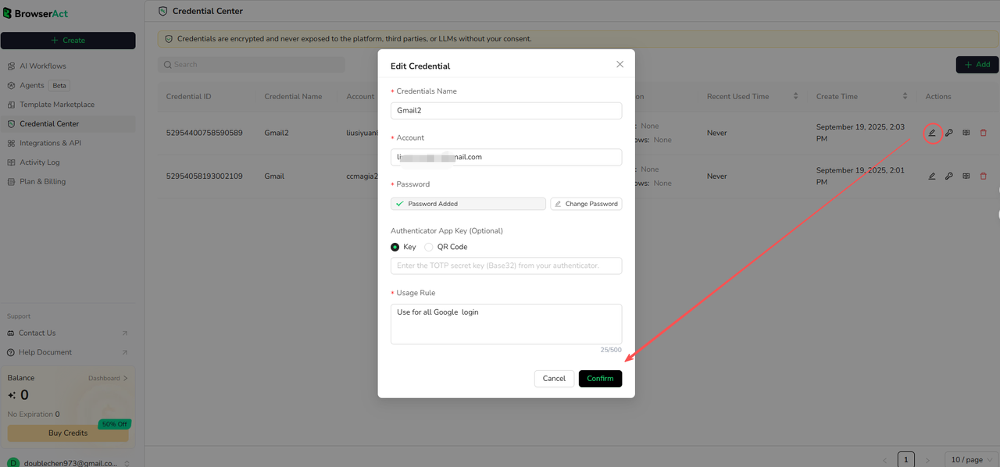

If a website password changes, update the saved credential before the next run.

### Revoke Workflow Authorization

1. Open the credential's authorization settings.
2. Under **Authorized Workflows**, select `Specific`.
3. Open the `Authorized` tab.
4. Select the revoke icon for the Workflow Built Bot.
5. Confirm the change.

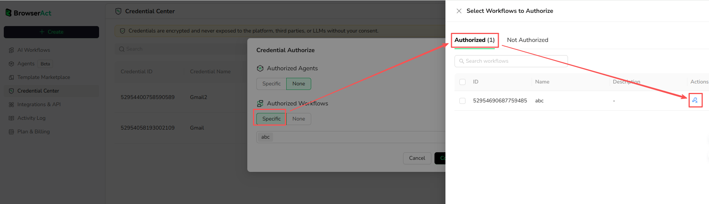

Revoking authorization may cause a Workflow Built Bot that depends on the credential to fail.

### View Usage Records

Select the usage-record icon in the credential's **Actions** column to review the available credential usage information.

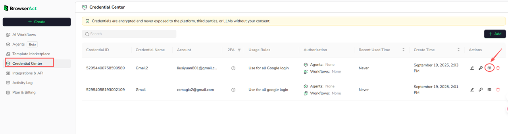

### Delete a Credential

Select the delete icon in the credential's **Actions** column when the credential is no longer needed.

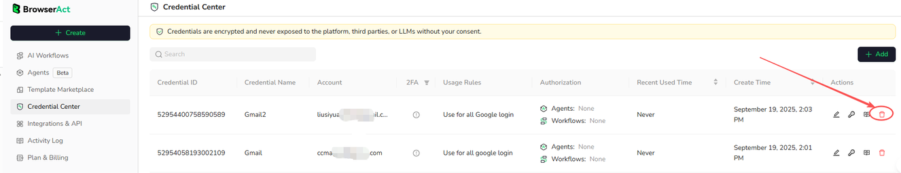

Deleting a credential disables its use in authorized workflows. Check workflow dependencies before deleting it.

## Troubleshoot Login Failures

Check the following:

- The username, email, or account identifier matches the target website.
- The password has not changed or expired.
- The account is not locked or suspended.
- The Authenticator App Key is current and entered correctly.
- The Workflow Built Bot is authorized to use the credential.
- `Use Stored Credentials` is enabled in the Start node when stored credentials are required.

When contacting support, include the Task ID and the login error shown by the run. Do not send passwords or 2FA secret keys.
