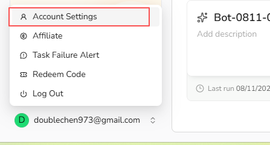
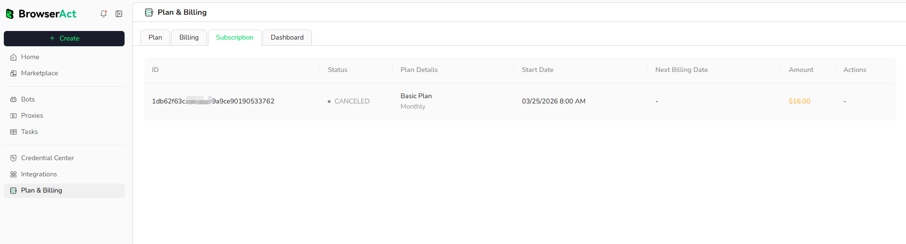

## Does BrowserAct support team member subaccounts or adding teammates?

Not yet. BrowserAct Cloud accounts are currently managed individually and do not include teammate invitations, member roles, or shared workspaces.

## How do I change my account email or password?

You cannot currently change the email address linked to your BrowserAct account.

To reset your password, open the account menu at the bottom of the BrowserAct dashboard, select `Account Settings`, and select `Reset` beside the Password field. If you cannot sign in, use the password reset option on the login page.

## How do I delete my BrowserAct account?

Account deletion is not currently available as a self-service option. Contact Support to request account deletion.

Before submitting the request, make sure you no longer need the account. Deleting it permanently removes all Bot and Workflow data and clears any remaining credits. Deleted data and credits cannot be recovered.

## Is it still possible to buy permanent credit packs or bundles?

No. Credit Packs are valid for the current monthly credit cycle.

You need an active subscription to purchase a Credit Pack. Pack credits expire at the next monthly credit reset and do not roll over.

This monthly reset rule also applies when the subscription itself is billed yearly.

## How can I get an invoice?

Create a ticket in the BrowserAct Discord community or email `support@browseract.com`. Include your order information, and the Support team will verify the purchase and issue the invoice.

Do not send full payment-card details, passwords, or other sensitive account information.

## How is a Static Proxy charged?

Static Proxies are charged in credits per proxy, per month. Pricing varies by location and proxy tier and is shown before purchase.

## Can BrowserAct provide the original username and password for a Static Proxy?

No. BrowserAct does not currently provide the original username and password for a Static Proxy. Use the proxy through the supported BrowserAct configuration and access methods.

## How is a Dynamic Proxy charged?

Dynamic Proxy usage costs **5,000 credits per GB**. Your total charge depends on the traffic generated by your Tasks.

## How is a local fingerprint browser charged?

Each local fingerprint browser costs **100 credits** to create.

Creating a replacement after deleting a browser incurs another 100-credit charge.

## How can I earn bonus credits?

- **Approved G2 review: 2,000 credits.** Publish an honest BrowserAct review. After the review is approved, send the approval screenshot to BrowserAct Support for verification.
- **New account registration reward.** Eligible new users may receive bonus credits. The amount is subject to change; review the offer shown during registration or in the current promotion.
- **Star the BrowserAct GitHub repository: 500 credits.** Star the official BrowserAct GitHub repository and follow the current verification instructions to claim the reward.

Rewards are subject to account eligibility and verification. A G2 reward is for an authentic, approved review and is not conditional on the opinion being positive.

## How can I check my credit usage?

Credit usage for both Agent CLI and BrowserAct Cloud is available in the Billing Dashboard.

1. Sign in to BrowserAct.
2. Open `Plan & Billing`.
3. Select `Dashboard`.

You can also open the [Billing Dashboard](https://www.browseract.com/reception/payment?tab=dashboard) directly. It shows total credits consumed, usage by service, usage trends, and detailed usage history.

## Why did I receive no registration credits after signing up?

Registration credits are available to the first eligible BrowserAct account registered from an IP address. If more than one account was created from the same IP address, only the first eligible account receives the reward.

Check whether another BrowserAct account has already been registered from your current network. If you still need help, contact Support with your account information.

## How do I apply for the BrowserAct Affiliate Program?

Visit the [BrowserAct Affiliate Program](https://www.browseract.com/affiliate) and submit the registration form. Once approved, you can earn commission by sharing BrowserAct through your affiliate link.

## When are affiliate commissions paid, and what is the minimum payout?

Affiliate commissions are settled once a month. The minimum payout is **$50**.

## How long does an affiliate referral link remain valid?

Affiliate referral links do not expire and can be shared at any time. When a user registers through your link, attribution is based on their latest valid tracked referral interaction.

## How do I cancel my subscription?

1. Open `Plan & Billing` from the BrowserAct dashboard.
2. Select the `Subscription` tab.
3. Locate the active subscription and choose the cancellation option.
4. Complete the confirmation steps shown in the account backend.

Your subscription will remain active until the end of the current billing cycle and will not renew.

