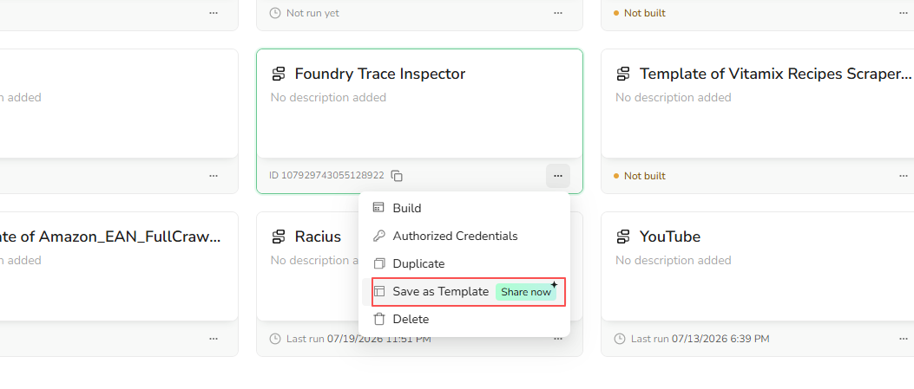

## All Bots

### Where can I see a Bot run?

Each build and run creates a Task. Open `Tasks` to view activity across all Bots. To view tasks for one Bot, open the Bot and select `History`.

### Why do I get an error when I run two Tasks on the same Bot?

A Bot using `Standard Browser` supports one active Task at a time because its runs reuse the same persistent browser environment.

To run multiple Tasks in parallel, open the Bot's `Browser settings` and switch to `Private Browser`. Also make sure your BrowserAct plan supports the number of concurrent Tasks you need.

### How do I get a Bot ID?

Open `Bots` and hover over a Bot card to reveal its ID. You can also open the Bot and find the ID in the page URL. Select the copy icon to copy it.

A `Workflow ID` shown in a legacy or third-party interface is the Bot ID.

### Can I share a Bot with another user?

It depends on how the Bot was built.

- **Agent Built Bot:** Copying and sharing are not currently supported.
- **Workflow Built Bot:** You can save the Bot as a personal template and share the template.

To create a shareable template, open `Bots`, select the three-dot menu on the Workflow Built Bot card, and select `Save as Template`.

The recipient uses the template to create a separate Bot. This does not give them access to your original Bot, run history, or credentials.

### How does BrowserAct reduce the cost of running a Bot after it has been built?

BrowserAct builds Agent Built Bots as reusable, script-based automations. The Agent provides intelligence during building, testing, and supported recovery, while routine runs use the published automation instead of repeating the full reasoning process.

This reduces repeated model and token usage while keeping execution fast and predictable.

### Can a Bot handle CAPTCHA or human verification?

Yes. BrowserAct automatically detects and handles supported CAPTCHA and verification challenges. When a challenge needs manual input, BrowserAct can continue through human-in-the-loop assistance.

Email or SMS codes, device confirmations, and account-specific checks may require your input.

### What types of CAPTCHA and human verification does BrowserAct support?

BrowserAct supports common verification systems, including:

- Google reCAPTCHA v2
- Google reCAPTCHA v3
- Google reCAPTCHA Enterprise
- Cloudflare Turnstile
- Cloudflare Challenge
- DataDome
- HUMAN Security (PerimeterX)

BrowserAct attempts supported checks automatically and uses human-in-the-loop assistance when manual input is needed.

### What should I do if BrowserAct cannot complete a CAPTCHA?

CAPTCHA behavior varies by website and verification provider. If BrowserAct cannot complete a challenge, contact Support and include the target URL, Bot ID, and Task ID. The team will investigate the verification flow and assess the required adaptation.

### Can BrowserAct be used on websites that require login?

Yes. BrowserAct supports login-protected websites.

- **Workflow Built Bots:** Save the account in Credential Center, authorize the Bot, and enable stored credentials in the Start node. You can also prompt for credentials on each run. See [Authorize a Workflow Built Bot](../credential-center/authentication-and-credentials.mdx#authorize-a-workflow-built-bot).
- **Agent Built Bots:** Complete the login through human-in-the-loop assistance. Select `Standard Browser` so the browser can retain and reuse the authenticated session in later runs. Managed credential hosting for Agent Built Bots is coming soon.

If the website requests a code, device confirmation, or another account-specific check, complete it through human-in-the-loop assistance.

## Agent Built Bots

### Can I copy or share an Agent Built Bot?

No. Agent Built Bots do not currently support copying or sharing.

### How do I update an Agent Built Bot?

Open the Agent Built Bot and select `Improve Bot` to update its behavior or extraction fields. Describe the change, test the draft, and publish it. Future runs use the new `Live` version.

`Improve Bot` applies only to Agent Built Bots.

### Can an Agent Built Bot use stored login credentials?

Not yet. For a login-protected website, sign in through human-in-the-loop assistance and select `Standard Browser` to retain the session for future runs.

Credential hosting for Agent Built Bots is coming soon.

## Workflow Built Bots

### Can I close the browser window after I run a Workflow Built Bot?

Yes. After you start the run, the Workflow Built Bot continues running in BrowserAct Cloud. You can close the BrowserAct page or your browser window without stopping the Task.

To check the status or results later, open the Bot and select `History`. You can also open `Tasks` to view activity across all Bots.

### Can a Workflow Built Bot run a login-protected process?

Yes. Save the login in Credential Center, authorize the Workflow Built Bot, and enable stored credentials in the Start node.

See [Authorize a Workflow Built Bot](../credential-center/authentication-and-credentials.mdx#authorize-a-workflow-built-bot) for the complete setup process.

Complete any account-specific verification through the available human-in-the-loop flow.
