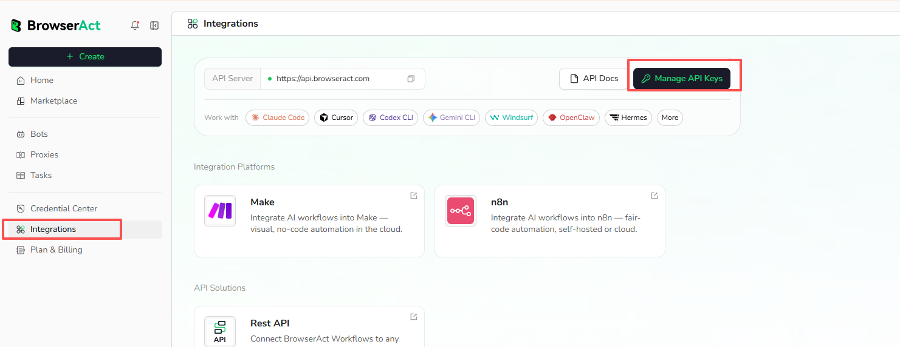
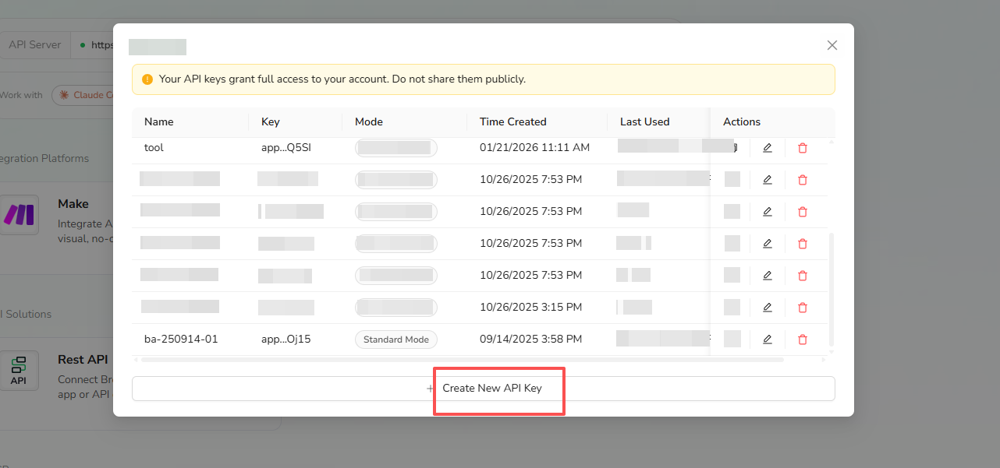
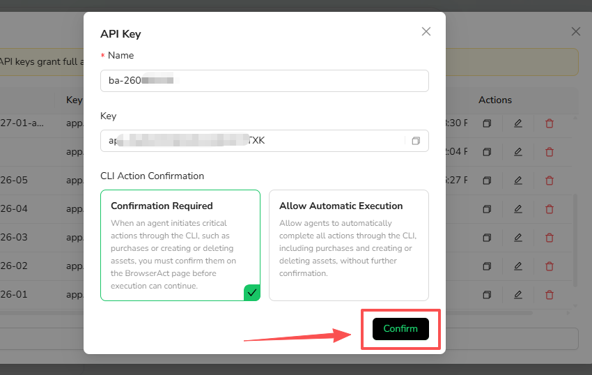
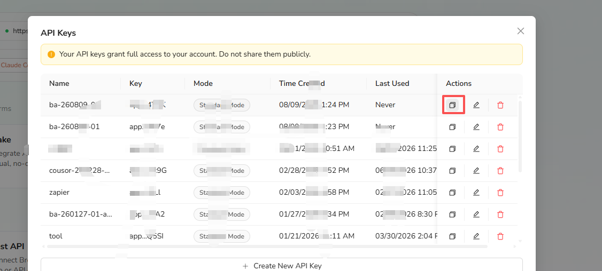

API keys authenticate BrowserAct integrations and API requests. An API key grants access to your account, so keep it private and create separate keys when you need to manage connections independently.

## Open API Key Management

1. Open `Integrations` in the BrowserAct dashboard.
2. Select `Manage API Keys`.

The Integrations page also shows the API server, API documentation, supported tools, and integration platforms.

## Create an API Key

1. In the API Keys window, select `Create New API Key`.

2. Enter a name that identifies where the key will be used.
3. Choose a **CLI Action Confirmation** mode.

### Confirmation Required

Critical actions initiated through the CLI must be confirmed on the BrowserAct page before execution can continue. These actions can include purchases and creating or deleting assets.

### Allow Automatic Execution

The connected agent can complete supported CLI actions without additional confirmation, including critical actions shown in the product warning.

Use this mode only for a trusted environment where unattended execution is required.

4. Select `Confirm`.

## Copy and Manage API Keys

The API Keys list shows each key's name, masked key value, mode, creation time, and last-used time.

Use the icons in the **Actions** column to:

- Copy the API key
- Edit its name or confirmation mode
- Delete the API key

Deleting a key stops integrations and clients that depend on it from authenticating. Update the connected tool before removing a key that is still in use.

## API Usage Limits

- **Rate limits:** No rate limits.
- **Free users:** 1 task per run.
- **Paid users:** Up to 20 concurrent tasks.
- **Task duration:** Up to 7 hours per task.

## Security Practices

- Do not place API keys in prompts, screenshots, public repositories, or shared documents.
- Use a separate key for each integration when practical.
- Prefer `Confirmation Required` unless automatic critical actions are necessary.
- Delete keys that are no longer used.
- If a key is exposed, delete it and create a replacement.

For endpoints, request headers, task status, result retrieval, and Webhooks, see the existing **API Reference**.
