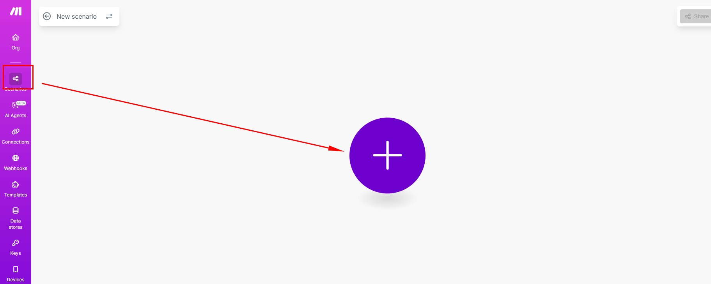
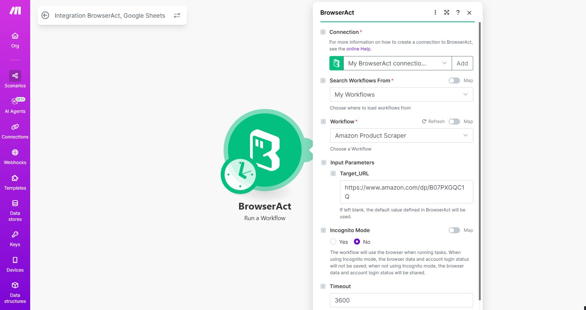
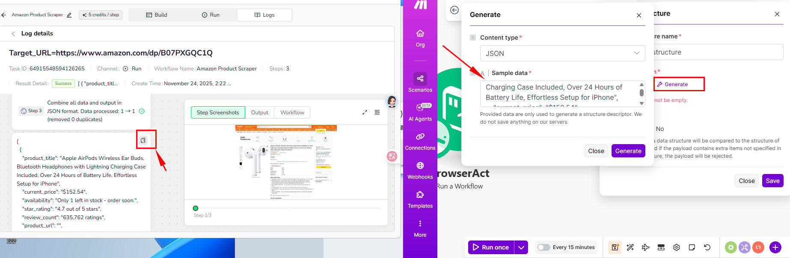
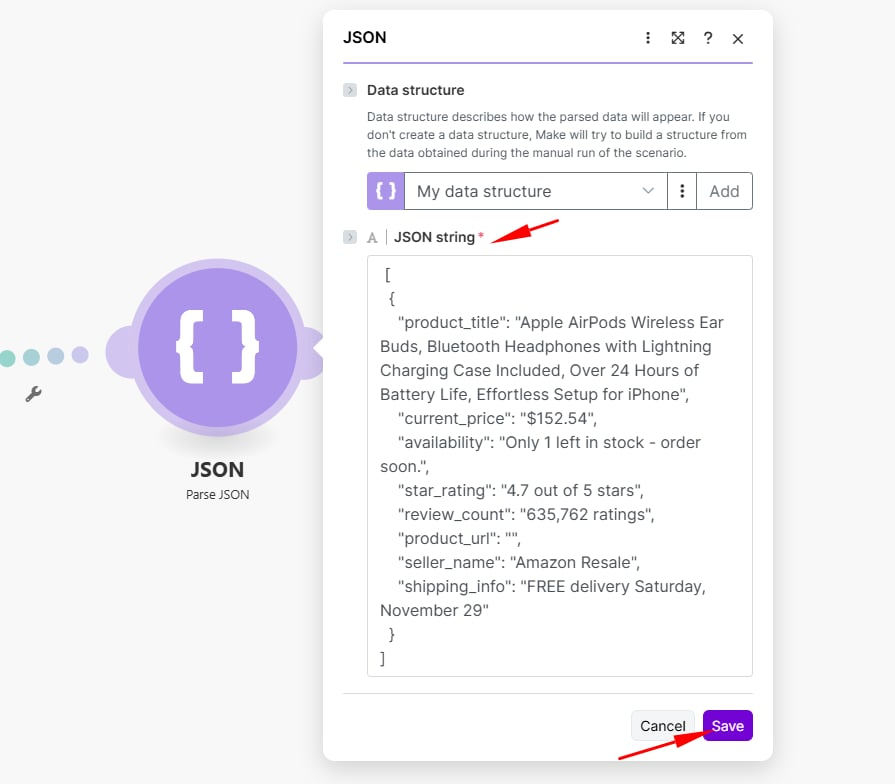
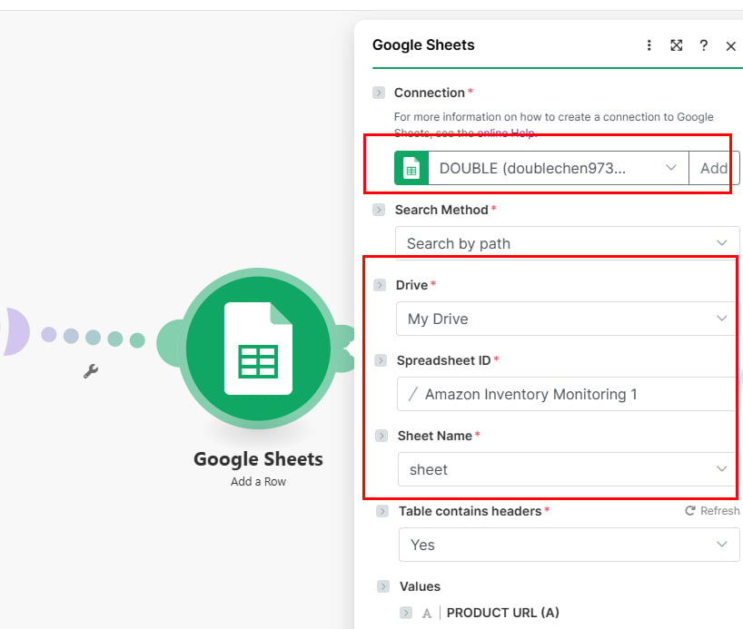
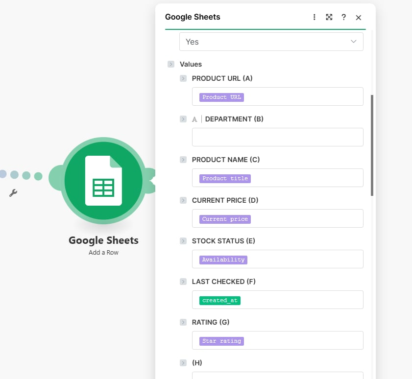
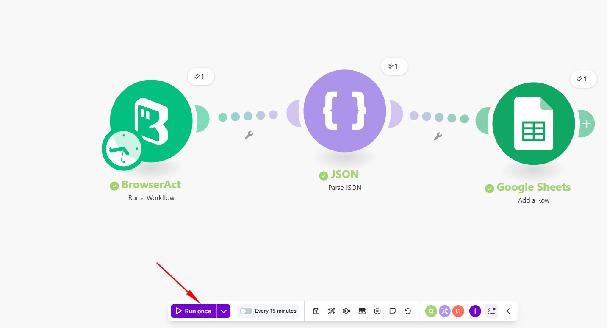

Google Sheets is used as a downstream application through Make. BrowserAct runs the Bot, Make processes the structured result, and Google Sheets stores each record as a row.

## Before You Start

- Prepare a BrowserAct Bot that runs successfully.
- For a Workflow Built Bot, set `Default Output Format` to `JSON` in the `Start` node.
- Create a Google Sheet with column headers that match the fields you want to store.
- Create a BrowserAct API key from `Integrations` > `Manage API Keys`.

## Build the Make Scenario

1. Create a scenario in Make and add the BrowserAct app.

2. Select `Run a Workflow`, connect your BrowserAct account, and choose the Workflow that corresponds to your Bot.

3. Configure the required Bot inputs.

4. Add `JSON` > `Parse JSON` and generate the data structure from a successful BrowserAct result.

5. If the result contains an array of records, add an `Iterator` after `Parse JSON`.
6. Add `Google Sheets` > `Add a Row`.

7. Select the spreadsheet and sheet, then map each BrowserAct result field to the matching column.

8. Run the scenario once and confirm that the rows are written correctly before activating it.

> **Naming note:** Make may display `Workflow` or `Run a Workflow`. These labels refer to the corresponding BrowserAct Bot.

## Troubleshooting

- If Make cannot parse the result, run the Bot again and use a complete JSON result to generate the data structure.
- If fields are missing, confirm that the Bot output and Google Sheets headers match.
- If no row is created, check the Google account connection and spreadsheet permissions.

See [Integrate BrowserAct with Make](../make.mdx) for the complete connection setup.
