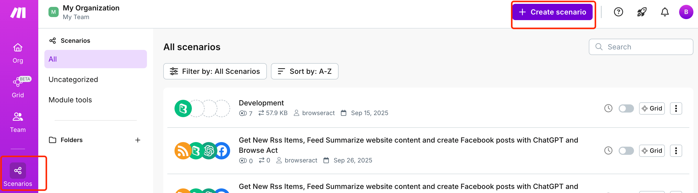
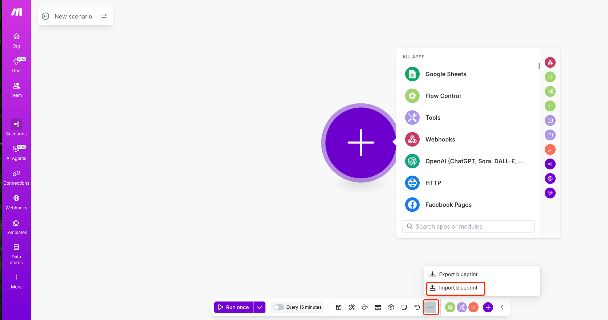
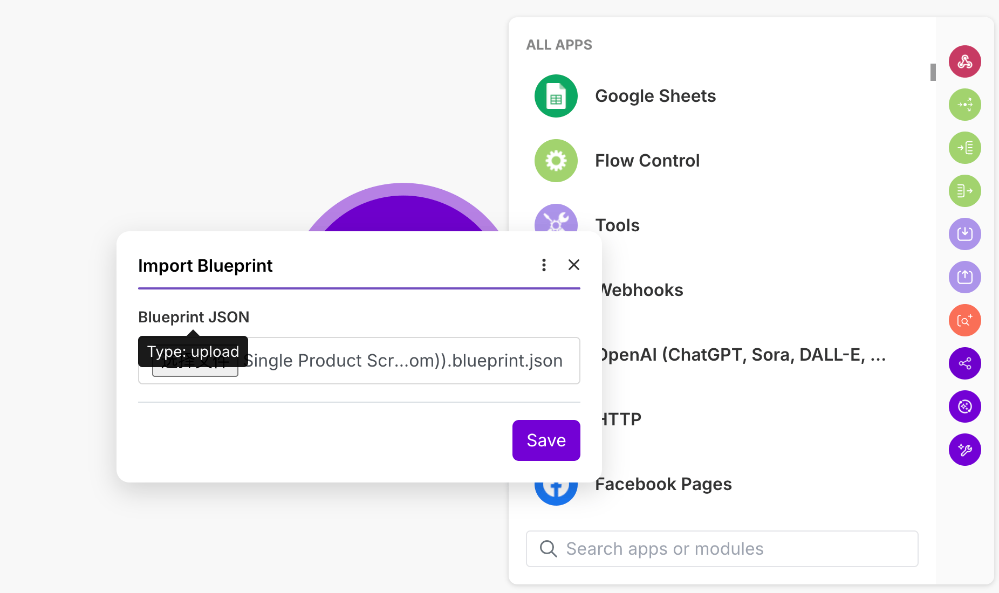
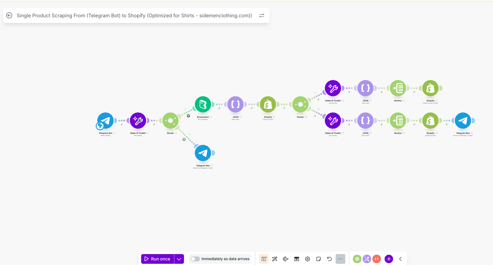

Make blueprints let you move or share a Make scenario as a JSON file. The file describes the scenario structure; it does not include a working BrowserAct connection or account credentials.

## Import a Make Blueprint

1. In Make, create a scenario.
2. Open the scenario menu and select `Import Blueprint`.

3. Choose the JSON file.

4. Review the imported modules, routes, filters, and mapped inputs.
5. Reconnect the BrowserAct module and any other applications.
6. Select the Workflow that corresponds to your BrowserAct Bot and verify its inputs.
7. Run the scenario once before activating it.

## Export a Make Blueprint

1. Open the Make scenario.
2. Open the scenario menu and select `Export Blueprint`.

3. Save the JSON file.

Before sharing a blueprint, review it for fixed values or other sensitive information. API keys and application credentials should never be added directly to the JSON file.

> A Make blueprint is a Make scenario file, not a BrowserAct Bot export.
