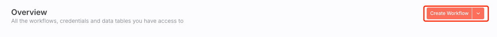
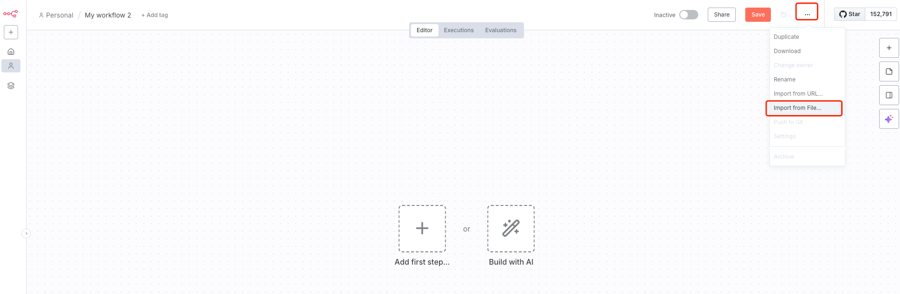
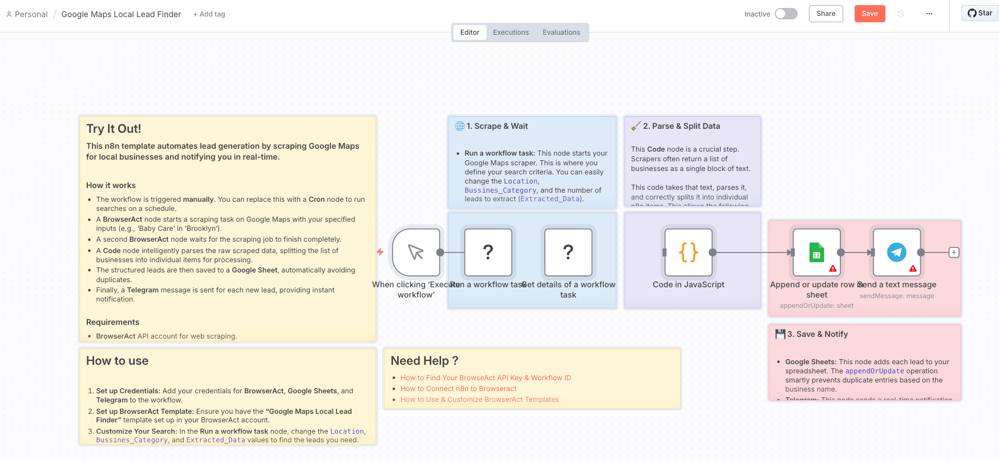
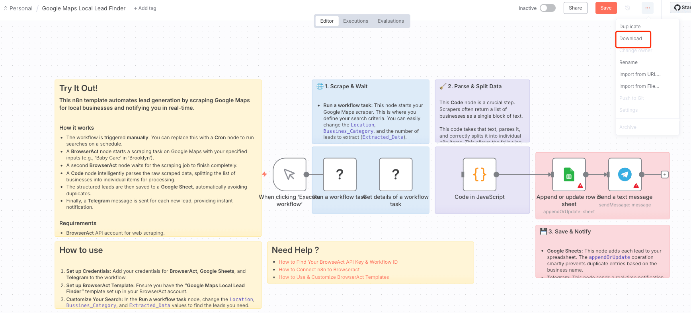

n8n workflows can be imported and exported as JSON. The file contains the workflow structure, but account credentials must be configured separately.

## Import an n8n Workflow

1. In n8n, create a workflow.
2. Open the workflow menu and select `Import from File`.

3. Choose the JSON file.

4. Review the imported nodes, connections, expressions, and input mappings.
5. Install or enable the BrowserAct node if n8n requests it.
6. Create or select the BrowserAct API credential.
7. Select the Workflow that corresponds to your BrowserAct Bot and configure its inputs.
8. Execute the node, verify the result, and activate the workflow when it is ready.

## Export an n8n Workflow

1. Open the n8n workflow.
2. Open the workflow menu and select `Download`.

3. Save the JSON file.

Before sharing the file, remove fixed secrets and review any embedded sample data. n8n credentials are managed separately and must be reconnected after import.

> An n8n workflow JSON file is an n8n automation file, not a BrowserAct Bot export.
