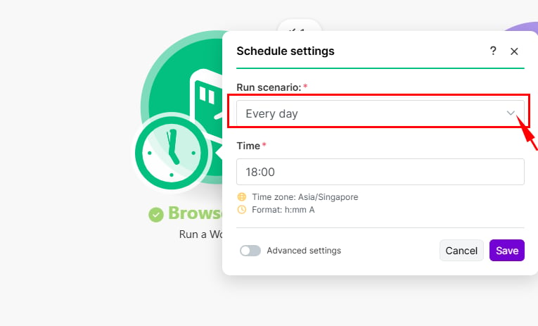

Use Make scheduling when a BrowserAct Bot needs to run at a recurring time or interval.

## Set Up a Scheduled Run

1. Create a Make scenario and add the BrowserAct app.

2. Select `Run a Workflow`, connect your BrowserAct account, and choose the Workflow that corresponds to your Bot.

3. Enter or map the required Bot inputs.
4. Open the scenario scheduling control.
5. Choose the interval, date, time, or supported schedule that fits the task.

6. Run the scenario once to verify the Bot and downstream modules.
7. Save and activate the scenario.

Review execution status in Make. In BrowserAct, open `Tasks` to view activity across all Bots, or open a specific Bot and select `History`.

## Common Uses

- Monitor prices or availability.
- Collect recurring reports.
- Refresh lead or market data.
- Send scheduled results to Google Sheets, a database, or another application.

> **Naming note:** Make may display `Workflow` or `Run a Workflow`. These labels refer to the corresponding BrowserAct Bot.

See [Integrate BrowserAct with Make](../make.mdx) for API key, connection, and input mapping instructions.
