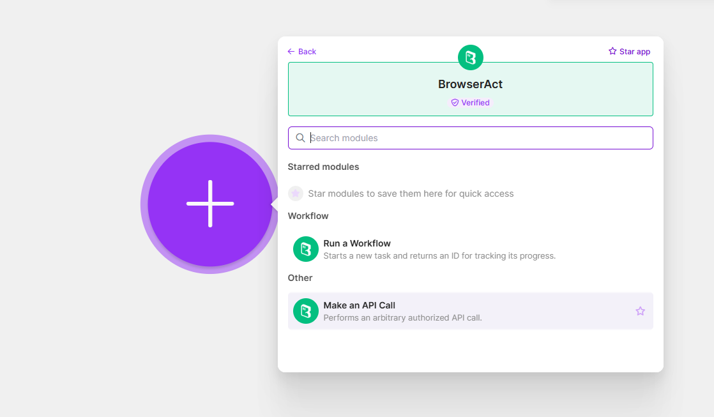
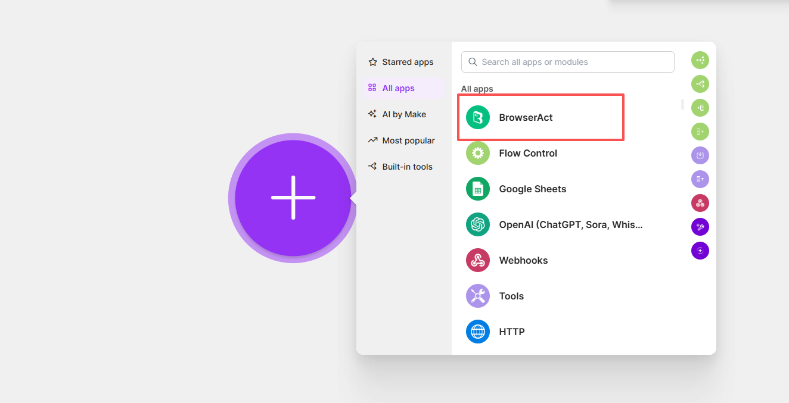
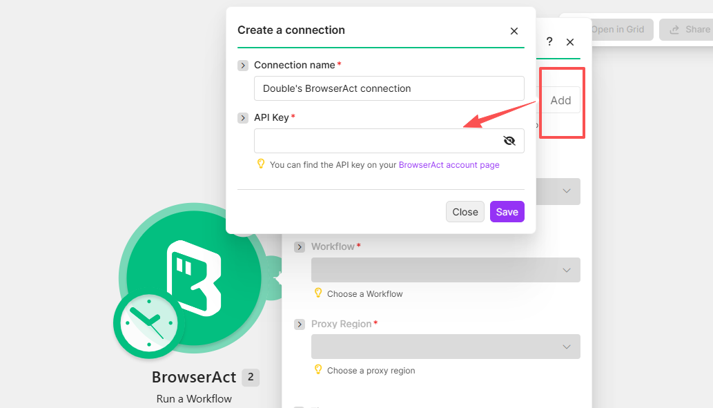
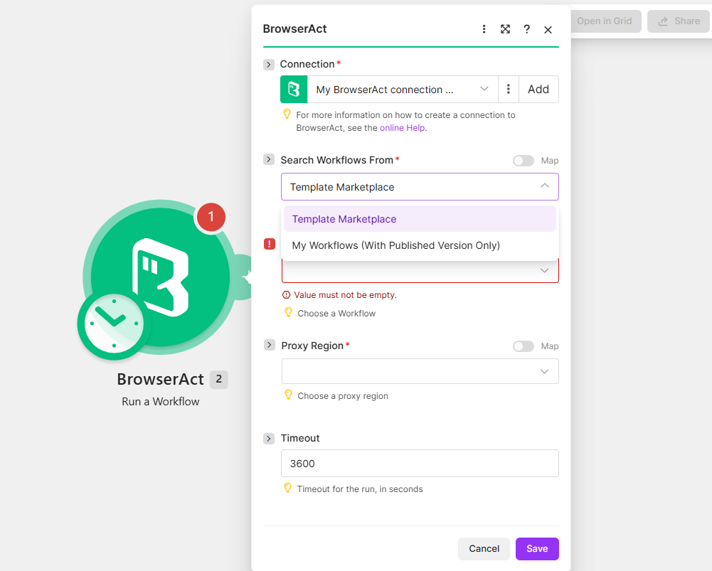
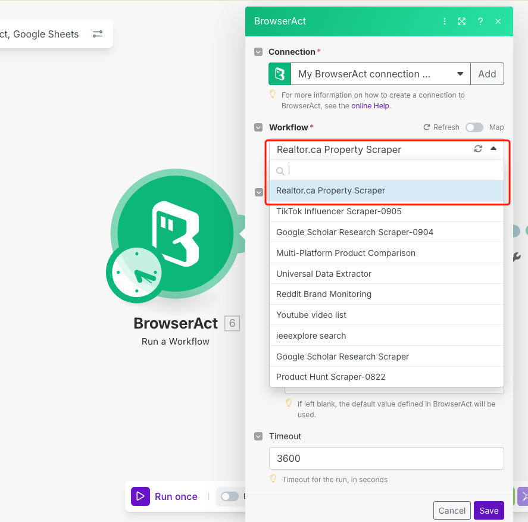
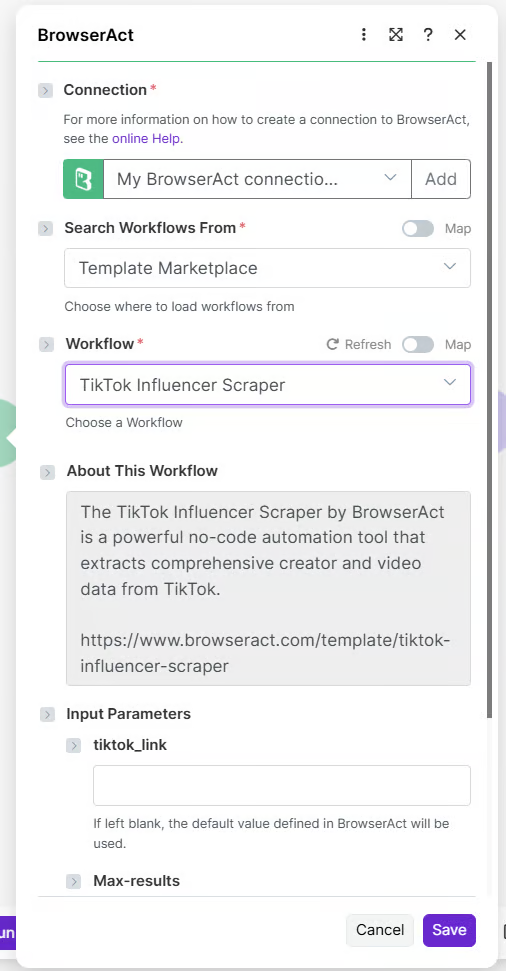

Use the BrowserAct app in Make to run a Bot from a scenario and pass its results to downstream modules such as Google Sheets, Slack, email, a database, or a CRM.

## Video Tutorial

[](https://www.youtube.com/watch?v=5tt0ZtcpwY8)

[Watch **BrowserAct and Make Automation Tutorial** on YouTube](https://www.youtube.com/watch?v=5tt0ZtcpwY8).

> **Naming note:** BrowserAct calls the automation a **Bot**. The current Make app may still display `Workflow` or `Run a Workflow`; these labels refer to the corresponding BrowserAct Bot.

## Available Actions

This guide uses the following Make actions:

- `Run a Workflow`: runs a Workflow Built Bot and returns a Task ID for tracking.
- `Make an API Call`: performs an authorized BrowserAct API request.



## Before You Start

Prepare the following:

- A BrowserAct Bot that runs successfully
- The Bot's required input values
- A BrowserAct API key
- A Make account

To create an API key, open `Integrations` > `Manage API Keys` > `Create New API Key`. Enter a name, choose the confirmation mode, select `Confirm`, and copy the key from the API Keys list.

## Connect BrowserAct to Make

1. In Make, create a scenario or open an existing one.
2. Add the trigger that should start the scenario.
3. Add a module and search for `BrowserAct`.
4. Select the BrowserAct app.



5. Choose `Run a Workflow`.
6. Under **Connection**, select `Add`.
7. Enter a connection name and paste the BrowserAct API key.
8. Select `Save`.



## Select a Bot

1. Under `Search Workflows From`, choose `My Workflows (With Published Version Only)` for your own Workflow Built Bots, or `Template Marketplace` for available templates.



2. Open the `Workflow` field.
3. Choose the Workflow that corresponds to your BrowserAct Bot.
4. If Make does not list the Bot, refresh the field or reconnect the BrowserAct account.

The following example selects a Workflow Built Bot through Make's current `Workflow` field.



## Map Bot Inputs

After a Bot is selected, Make displays the input parameters required by that Bot.

For each parameter, either:

- Enter a fixed value.
- Map a value from an earlier Make module.

For example, a Bot input named `keyword` can receive a fixed search term or a value submitted by a form, Webhook, spreadsheet row, or CRM record.



## Test the Scenario

1. Select `Run once` in Make.
2. Trigger the scenario with test data.
3. Confirm that BrowserAct creates a Task.
4. Review the BrowserAct module output in Make.
5. If the Task fails, open the related Task in BrowserAct and review its status and result.

## Use Bot Results

Add another Make module after BrowserAct and map the returned fields to the destination.

Common destinations include:

- Google Sheets
- Slack or email
- Airtable or Notion
- A database
- A CRM
- An AI processing step

Google Sheets is used as a downstream Make module; it is not configured as a direct BrowserAct integration.

## Schedule Runs

Use Make's scheduling settings when the Bot should run automatically.

1. Configure and test the complete scenario.
2. Open the scenario scheduling settings.
3. Choose the required interval or schedule.
4. Save and activate the scenario.

The available schedules, time zones, retries, and plan limits are controlled by Make.

## Common Scenarios

### Scheduled Data Collection

Run a BrowserAct Bot on a Make schedule and send the structured result to Google Sheets, a database, or email.

```text
Make Scheduler > BrowserAct > Google Sheets or Database > Email
```

### Lead Enrichment

Use a form, CRM event, or Webhook to provide a company name or website. Run the BrowserAct Bot and write the enriched result back to the CRM.

```text
Form or CRM Trigger > BrowserAct > CRM Update
```

### Price Monitoring and Alerts

Run a product-monitoring Bot at a regular interval, compare the returned value, and notify the team when a condition is met.

```text
Make Scheduler > BrowserAct > Filter > Slack or Email
```

## Troubleshooting

| Problem | What to check |
| --- | --- |
| Authentication failed | Copy the current API key again, remove extra spaces, or create a new Make connection. |
| Bot is not listed | Confirm that the Bot runs in BrowserAct, refresh the Workflow field, and reconnect BrowserAct if needed. |
| Required input is missing | Confirm that every required Bot input has a fixed or mapped value. |
| Task returns no data | Run the Bot with the same inputs in BrowserAct and review the resulting Task. |
| Task takes too long | Check the target website, Bot inputs, Browser and Proxy settings, and unnecessary Wait nodes in a Workflow Built Bot. |

For current BrowserAct actions available in Make, see the [BrowserAct integration on Make](https://www.make.com/en/integrations/browser-act).
