BrowserAct MCP Server lets compatible MCP clients discover and run BrowserAct Bots as MCP Tools.

> **Naming note:** The MCP interface currently uses `Workflow`. In the new BrowserAct product structure, the completed automation is managed as a Bot, and a legacy Workflow ID corresponds to the Bot ID.

## What Is BrowserAct MCP Server?

BrowserAct MCP Server connects MCP clients to BrowserAct Bots through the Model Context Protocol. A connected client can discover exposed tools, provide inputs, run the Bot, and receive its result.

You can use it to:

- Run browser automation from a chat or agent interface
- Pass runtime inputs in natural language
- Return results as text or files
- Expose multiple BrowserAct Bots from one MCP Server

## Supported MCP Clients

BrowserAct can connect to clients that support the required MCP server transport and authentication method, including clients shown in the current BrowserAct setup interface.

Compatibility depends on the client, not only on the AI model name. For a client that is not listed, follow its instructions for adding a generic MCP Server.

## Before You Start

Prepare the following:

- A BrowserAct account
- A published BrowserAct Bot
- An MCP-compatible client
- A Bot that does not require manual credential input on every run

## How to Use MCP

BrowserAct supports two MCP setup paths:

- Convert an Agent Built Bot into an MCP Tool from the Bot's `Integrations` tab.
- Convert a Workflow Built Bot into an MCP Tool from the Workflow Builder's MCP configuration.

## Convert an Agent Built Bot into an MCP Tool

Use this path when the Bot was created with Agent Built.

### Step 1: Select the Bot to Expose

1. Open `Bots`.
2. Find the Agent Built Bot you want to expose as an MCP Tool.
3. Select the Bot.

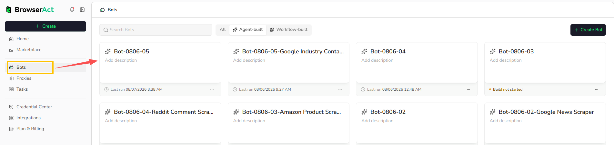

### Step 2: Create an MCP Server and Expose the Tool

#### Create an MCP Server

1. Open the Bot's `Integrations` tab.
2. Find the `MCP` card.
3. Select `MCP Server`.

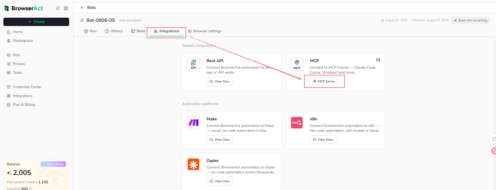

Before exposing the Bot, you can review or edit the MCP Tool's basic information from the settings icon on the `MCP` card. BrowserAct generates the Tool Call Name, Tool Description, and input descriptions automatically, but you can adjust them before exposing the Bot to MCP clients.

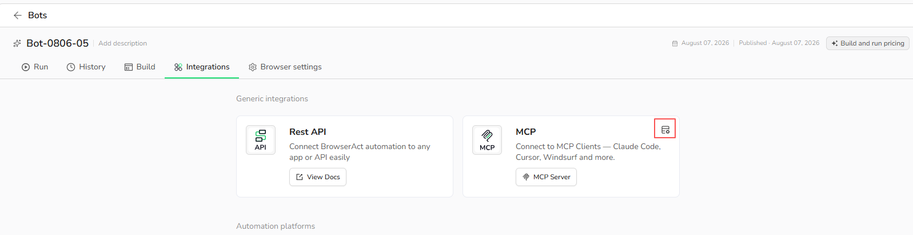

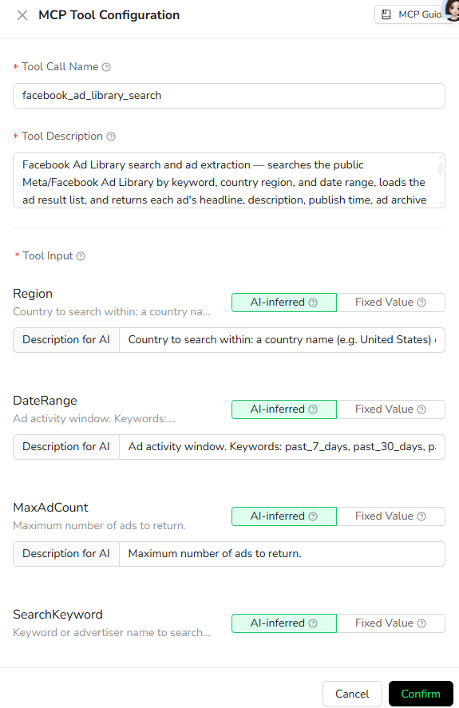

Select `Add MCP Servers`, enter a server name and optional description, then select `Confirm`.

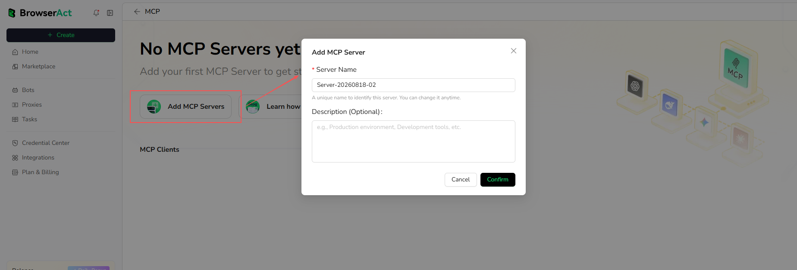

#### Expose the Tool

After the MCP Server is created, select the `Server Management` icon for that server.

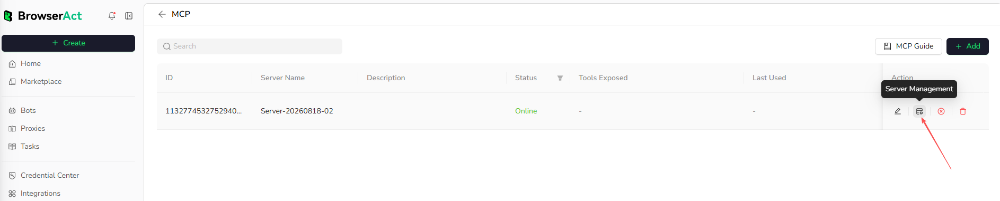

1. Open `Exposed Tools`.
2. Select `Not Exposed`.
3. Select the Bot you want to expose.
4. Select the expose action, then confirm.

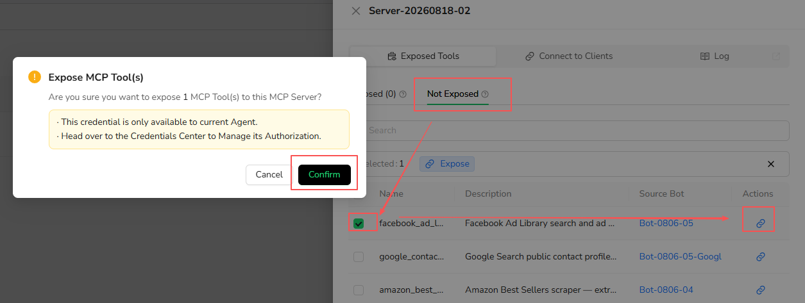

### Step 3: Connect an MCP Client

1. Open `Connect to Clients` for the MCP Server.
2. Copy the MCP Server URL.
3. Create or copy the API Key from the same MCP Server.
4. Select the MCP client you want to connect, then follow the setup instructions shown in BrowserAct.
5. Reload the client if required and confirm that the exposed Agent Built Bot appears as an available MCP Tool.

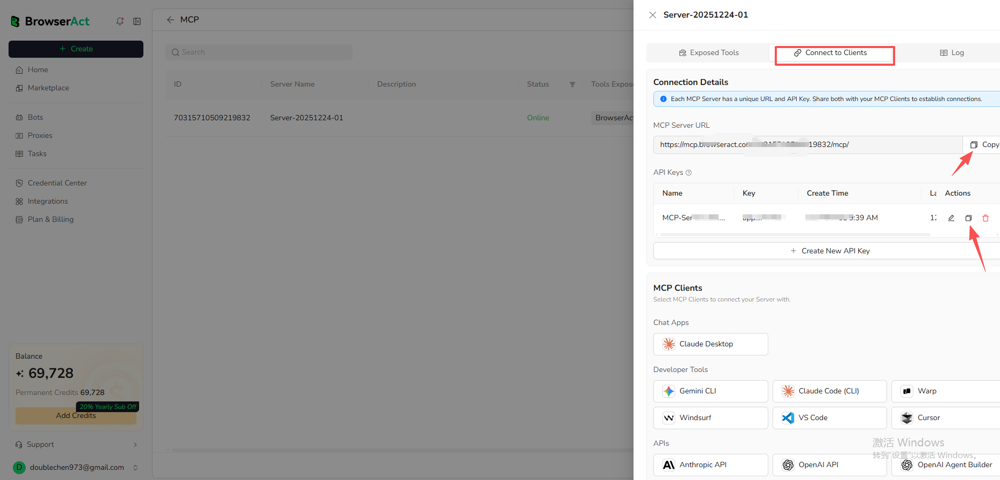

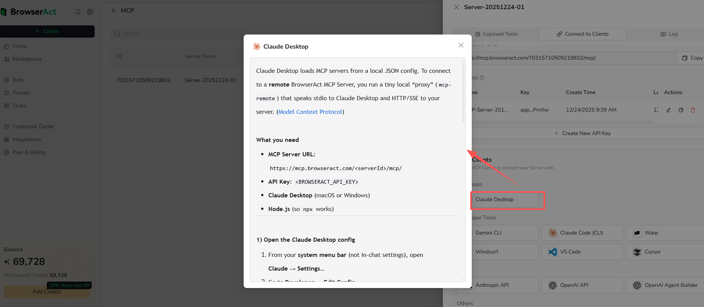

Use the MCP Server URL and API Key from the same server. Do not share the API Key in prompts, screenshots, repositories, or public configuration files.

## Convert a Workflow Built Bot into an MCP Tool

Use this path when the Bot was created with Workflow Built.

### Step 1: Select the Workflow Built Bot to Expose

1. Open the Workflow Built Bot.
2. Select `MCP Configure`.
3. Turn on `MCP-Ready`.

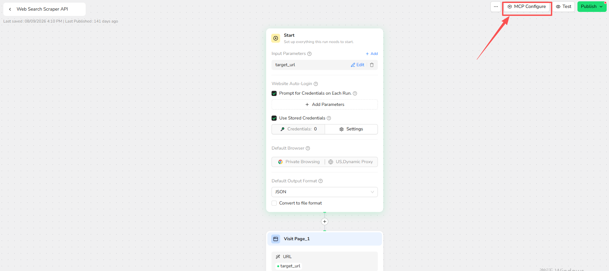

Turning on `MCP-Ready` does not activate the tool immediately. Publish the Workflow after completing the configuration.

### Configure the Tool

Enter the following information:

- **Tool Call Name:** Use 2-32 characters. Start with a letter and use only letters, numbers, and underscores. The name must be unique within the account.
- **Description:** Explain what the tool does and when the MCP client should use it.
- **Tool Output Method:** Choose `Text` or `File` based on the expected result.

Clear tool names and descriptions help the MCP client select the correct tool.

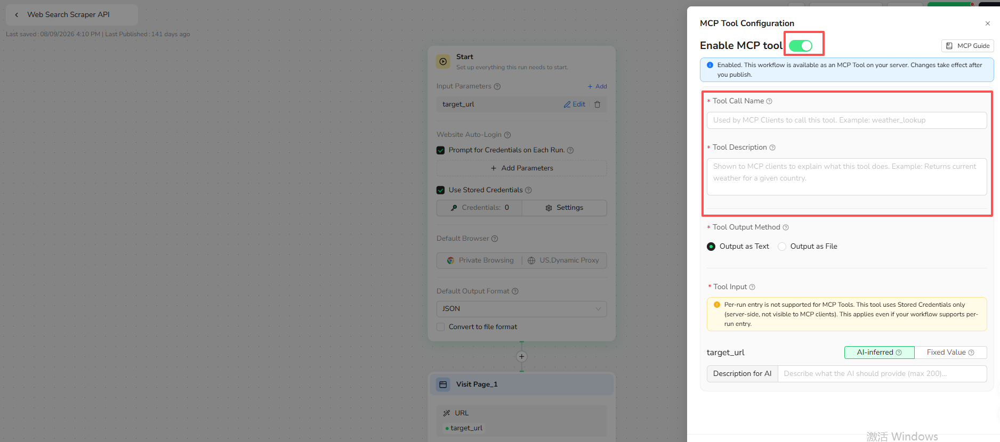

#### Configure Input Parameters

Choose how each Workflow input is provided:

- **AI-Inferred:** The MCP client supplies the value at runtime. Add a clear parameter description.
- **Fixed Value:** BrowserAct uses the same value for every execution.

MCP Tools do not support credentials entered manually for each run. Use credentials stored and authorized through Credential Center.

After the configuration is published, update the Workflow and publish again when its MCP parameters need to change.

#### Publish the Workflow

Select `Publish` after the MCP configuration is complete. MCP clients run the latest published configuration; unpublished changes are not available to them.

### Step 2: Create an MCP Server and Expose the Tool

Open the MCP Server page:

1. Open `Integrations` in BrowserAct Cloud.
2. Find the `MCP` section.
3. Select the `MCP` card.

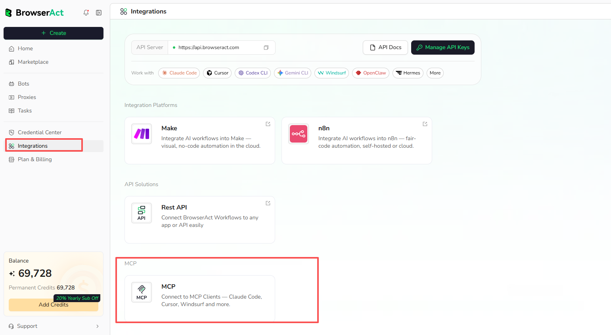

1. Select `Add` on the MCP Server page.

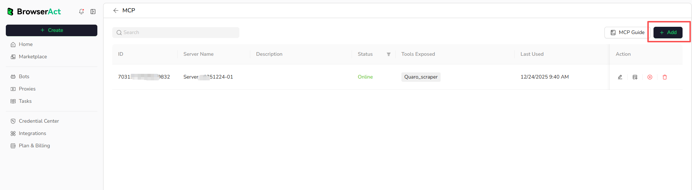

2. Enter a unique Server Name.
3. Add an optional description.
4. Select `Confirm`.

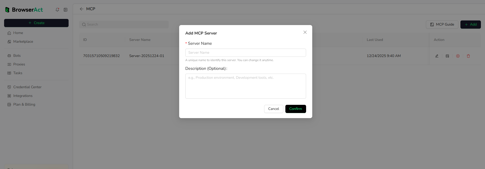

Expose the Workflow Built Bot as an MCP Tool:

1. Select `Management` for the target MCP Server.

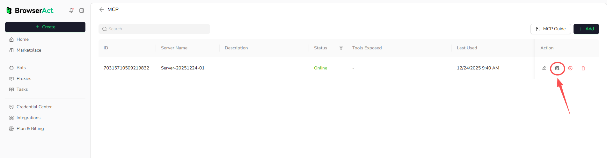

2. Open `Exposed Tools` and select `Not Exposed`.
3. Find the MCP Tool and select the expose action.

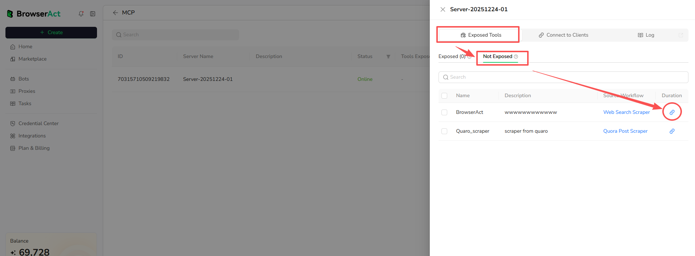

4. Review the notice and select `Confirm`.

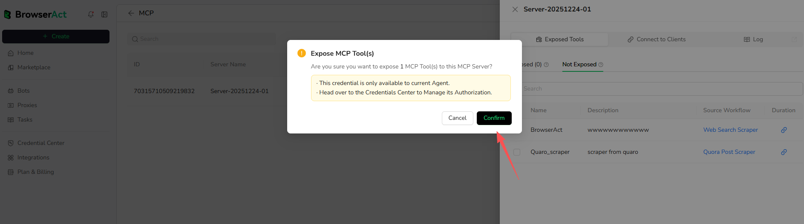

Only published, MCP-ready Bots can be exposed. One MCP Server can expose multiple MCP Tools.

### Step 3: Connect an MCP Client

Each MCP Server has its own MCP Server URL and API Key. Use the matching pair from the same server.

Get the Server URL and API Key:

1. Open `Management` for the target MCP Server.
2. Open `Connect to Clients`.
3. Copy the MCP Server URL.
4. Select `Create New API Key`, then copy the generated key from the Actions column.


This is the MCP Server connection key. It is managed from the MCP Server, not from the general `Manage API Keys` page.

Configure the client:

1. Select the target MCP client in `Connect to Clients`.
2. Open the setup instructions for that client.
3. Add the MCP Server URL and API Key to the client's configuration.
4. Reload the client if required.
5. Confirm that the exposed BrowserAct tools are available.


Do not expose the API Key in prompts, screenshots, repositories, or shared configuration files.

## Run an MCP Tool

Ask the connected client to run the exposed BrowserAct tool and include the required runtime inputs.

To run a BrowserAct MCP Tool in Codex, use a prompt like this:

```text
Connect to the BrowserAct Tool through the provided MCP Server URL and return the output as structured data.

MCP Server URL:
https://mcp.browseract.com/************/mcp/

Before calling the tool, verify whether the required BrowserAct MCP Key is already authorized and available in the current environment. If the key is missing, invalid, or not authorized, do not continue with the tool call. Instead, guide the user to install or configure the BrowserAct MCP Key at the exact required file location. Provide the concrete file path, the configuration snippet or format to add, and the steps to retry the connection after setup is complete.
```

Open the MCP Server's execution logs to review status, duration, and errors.

## Troubleshooting

### Authentication Error

- Confirm that the API Key belongs to the selected MCP Server.
- Copy the key again from `Management > Connect to Clients`.
- Confirm that the key has not been revoked or deleted.

### MCP Client Cannot Find Tools

- Confirm that the MCP Server URL is correct.
- Confirm that the MCP Server is online.
- Confirm that at least one tool is exposed.
- Confirm that the Bot is MCP-ready and published.
- Reload the MCP client after changing the configuration.

### MCP Client Cannot Run a Tool

- Check the BrowserAct credit balance.
- Confirm that every required input is available.
- Improve the tool and parameter descriptions if the client selects or fills them incorrectly.
- Review the MCP Server execution logs.

## MCP Limits and Behavior

### Can Agent Built Bots Be Used as MCP Tools?

Yes. Agent Built Bots can be exposed as MCP Tools from the Bot's `Integrations` tab. See [Convert an Agent Built Bot into an MCP Tool](#convert-an-agent-built-bot-into-an-mcp-tool).

### Can Every Workflow Built Bot Be Exposed?

Most can be exposed, except Bots that require users to enter credentials manually on every run.

### How Many MCP Servers Can I Create?

- Free accounts: 1 MCP Server
- Paid accounts: Unlimited MCP Servers

### How Many Tools Can One Server Expose?

There is no fixed tool-count limit. One MCP Server can expose multiple MCP Tools.

### Do MCP API Keys Expire?

They do not expire by default. You can revoke or regenerate them from MCP Server management.

### What Happens When the Workflow Changes?

Publish the updated Workflow. MCP clients use the latest published configuration and continue using the previous one until the update is published.

### What Happens When the MCP Server Is Offline?

MCP clients cannot connect to or run its tools. The exposure configuration remains saved.
