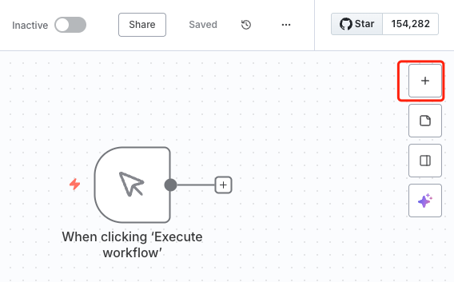
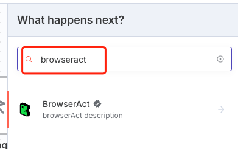
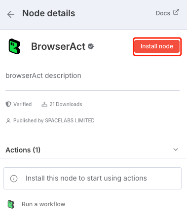
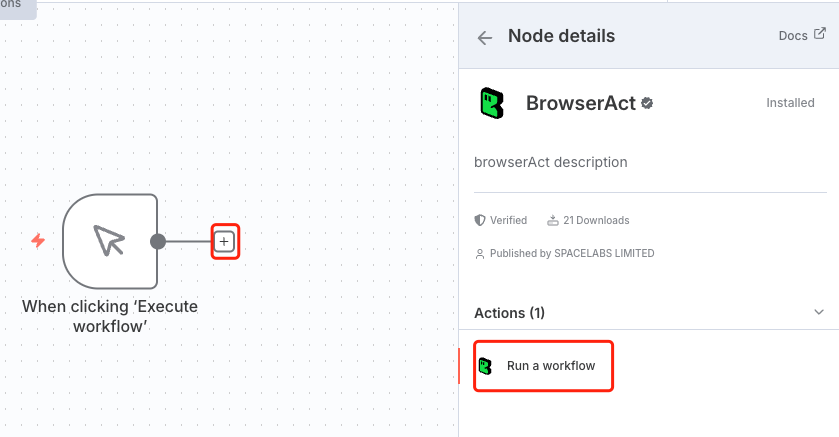
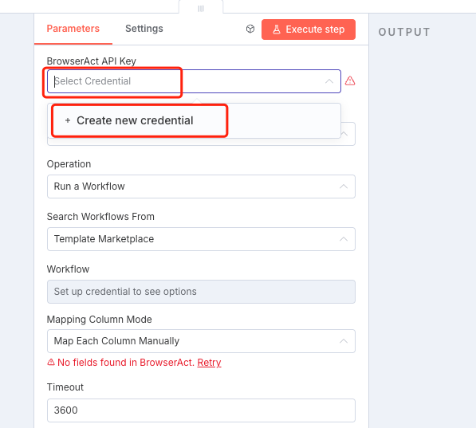
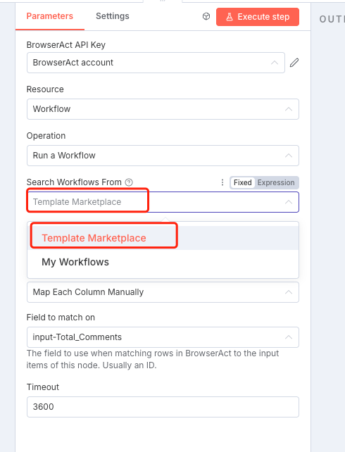
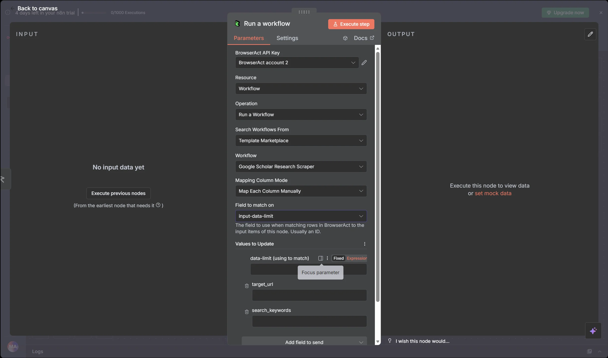

Use the verified BrowserAct node in n8n to run a BrowserAct Bot and pass its structured results to other nodes in the workflow.

## Video Tutorial

[](https://www.youtube.com/watch?v=2CfEBOfpRcM)

[Watch **Integrate BrowserAct with n8n in 60 Seconds** on YouTube](https://www.youtube.com/watch?v=2CfEBOfpRcM).

> **Naming note:** BrowserAct calls the automation a **Bot**. The current n8n node uses `Workflow` and `Run a Workflow`; these labels refer to the corresponding BrowserAct Bot.

## Before You Start

Prepare the following:

- A BrowserAct Bot that runs successfully
- The Bot's required input values
- A BrowserAct API key
- An n8n Cloud or self-hosted n8n instance

Verified nodes may need to be enabled by the n8n instance owner before other users can add them.

To create an API key, open `Integrations` > `Manage API Keys` > `Create New API Key`. Enter a name, choose the confirmation mode, select `Confirm`, and copy the key from the API Keys list.

## Add the BrowserAct Node

1. In n8n, create a workflow or open an existing one.
2. Select `+` to add a node.



3. Search for `BrowserAct` and open the verified BrowserAct node.



4. If prompted, select `Install node`.



5. Select `Run a workflow` to add the action to the canvas.



## Connect BrowserAct to n8n

1. Open the BrowserAct node.
2. Under **Credential to connect with**, create a new BrowserAct credential.
3. Paste the BrowserAct API key.
4. Save and select the credential.



## Select a Bot

1. Set the BrowserAct resource to `Workflow` when this field is shown.
2. Set the operation to `Run a Workflow`.
3. Under `Search Workflows From`, choose `Template Marketplace` or `My Workflows`.
4. Choose the Workflow that corresponds to the BrowserAct Bot.
5. Refresh the field or reconnect the credential if the Bot is not listed.



The n8n node may continue to use Workflow terminology until the third-party integration is updated.



## Map Bot Inputs

After a Bot is selected, configure each input required by the Bot.

For each input, either:

- Enter a fixed value.
- Use an n8n expression to map data from an earlier node.

For example, a Bot input named `company_url` can receive a value from a form submission, Webhook, spreadsheet row, database query, or CRM record.

## Test the Workflow

1. Execute the BrowserAct node with test data.
2. Confirm that BrowserAct creates a Task.
3. Review the node output in n8n.
4. If the Task fails, open the related Task in BrowserAct and review its status and result.
5. Save the n8n workflow after the test succeeds.

## Use Bot Results

Add downstream n8n nodes and map fields returned by BrowserAct.

Common destinations include:

- Google Sheets
- Slack, Telegram, or email
- Airtable or a database
- A CRM
- WordPress or another publishing system
- An AI processing node

Google Sheets is used as a downstream n8n node; it is not configured as a direct BrowserAct integration.

## Schedule Runs

Use an n8n schedule trigger when the Bot should run automatically.

1. Add a schedule trigger before BrowserAct.
2. Configure the required interval and time zone.
3. Test the complete workflow.
4. Save and activate it.

The available schedules, retries, execution limits, and time zones are controlled by the n8n instance and plan.

## Common Scenarios

### Collect Data and Update Google Sheets

Run a BrowserAct Bot, add the structured result to Google Sheets, and notify a Slack channel.

```text
Schedule Trigger > BrowserAct > Google Sheets > Slack
```

### Enrich Leads

Read a company or contact from a form, spreadsheet, or CRM, run BrowserAct, and write the enriched fields to the destination.

```text
Input Source > BrowserAct > CRM or Database
```

### Create a Content Pipeline

Collect source data with BrowserAct, process it with an AI node, and send the result to a publishing or review step.

```text
Trigger > BrowserAct > AI Processing > WordPress or Review Queue
```

## Troubleshooting

| Problem | What to check |
| --- | --- |
| BrowserAct node is unavailable | Confirm that the verified node is enabled for the n8n instance. |
| Authentication failed | Copy the current API key again, remove extra spaces, or recreate the n8n credential. |
| Bot is not listed | Confirm that the Bot runs in BrowserAct, refresh the Workflow field, and reconnect the credential if needed. |
| Input parameter is missing | Confirm that every required Bot input has a fixed value or valid n8n expression. |
| Task returns no data | Run the Bot with the same inputs in BrowserAct and review the resulting Task. |
| Task takes too long | Check the target website, Bot inputs, Browser and Proxy settings, and unnecessary Wait nodes in a Workflow Built Bot. |

For the current verified node and community workflow examples, see the [BrowserAct integration on n8n](https://n8n.io/integrations/browseract/).
