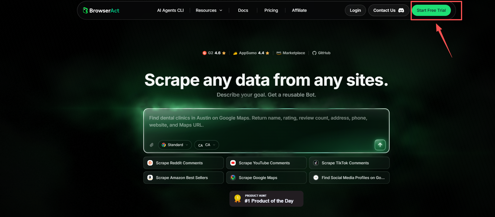
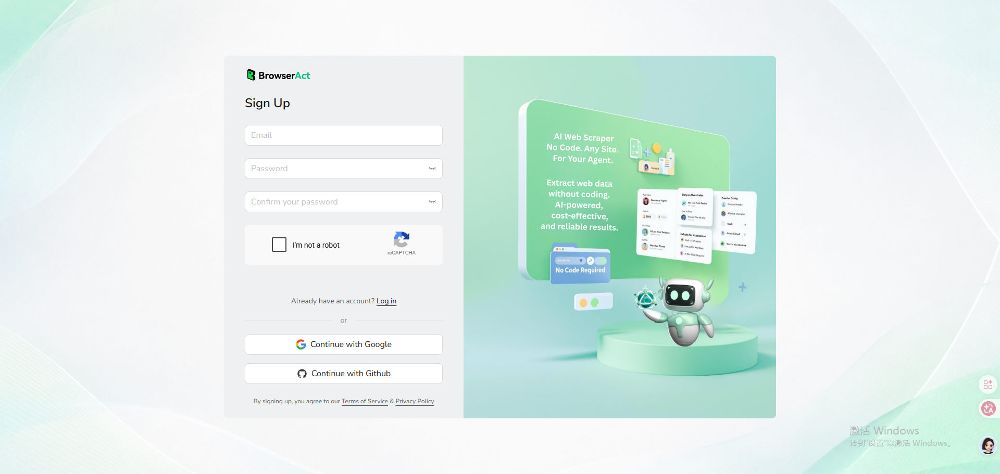
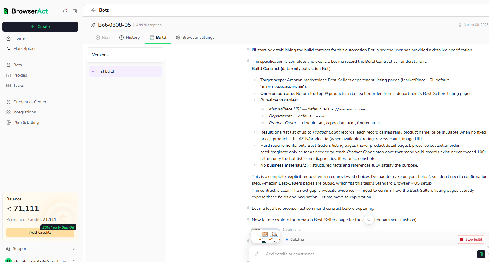
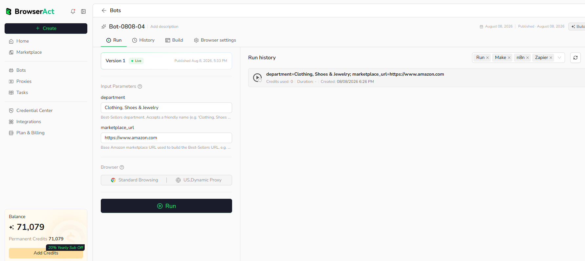
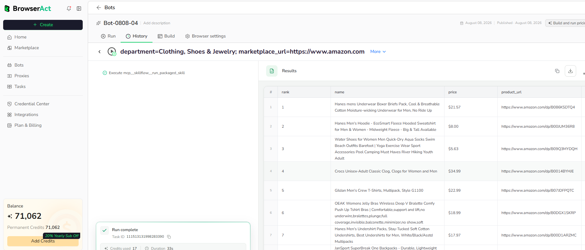

This guide takes you from describing a data request to your first structured result.

## Video Tutorial

[](https://www.youtube.com/watch?v=1M11lfNW7rE)

[Watch **Build a Reusable Web Scraper from One Prompt** on YouTube](https://www.youtube.com/watch?v=1M11lfNW7rE).

## Before You Start

You need a BrowserAct account before you can build a Bot.

1. Open the [BrowserAct website](https://www.browseract.ai/doc) and select `Start Free Trial`.



2. Create your account with an email and password, or continue with Google or GitHub.



3. Complete the required registration and onboarding questions to enter the Cloud dashboard.

---

## Quick Start

## Step 1: Describe What You Need

On Home, start Agent Built in either of these ways:

- Select one of the configured prompt templates below the prompt box.
- Enter your own request directly in the prompt box.


You can also select `Create`, then choose `Start building` under `Build with Agent`.


For a clear request, include:

- **Website:** Where BrowserAct should start
- **Records:** What items or pages to collect
- **Conditions:** Keywords, categories, locations, filters, or date ranges
- **Fields:** The exact data to return
- **Limit:** How many results you need
- **Inputs:** Values you want to change in future runs

Example:

```text
Go to the Amazon Best Sellers page and collect the top 20 products
from the Clothing, Shoes & Jewelry department. Return the rank,
product name, price, rating, review count, image URL, and product URL.
```

Submit the request when it describes the result you expect.

## Step 2: Let BrowserAct Build and Test the Bot

BrowserAct explores the live website, determines how to reach the requested records, and tests the extraction.

During the build, BrowserAct may navigate pages, apply filters, scroll, follow pagination, open detail pages, and validate output fields.



If BrowserAct asks for more information, reply in the same build conversation. Add the missing URL, condition, field, example, or expected result.

Some websites may require login or verification. Complete a supported user-assistance step only when BrowserAct requests it and you are authorized to access the page.

## Step 3: Run the Bot and Get Results

When the build is complete, select `Run` at the bottom of the Build page to run the Bot.



When the run is complete, review the structured result.



If an Agent Built Bot needs different fields or a changed navigation path, open its Build page and use [Improve Bot](../bot/improve/improve-a-bot.md).

## What to Do Next

- Learn how Agent Built works in detail.
- Configure Browser and Proxy settings when the website has a regional or session requirement.
- Open Tasks to inspect run status and results.
- Connect a tested Bot to Make, n8n, or Zapier.
