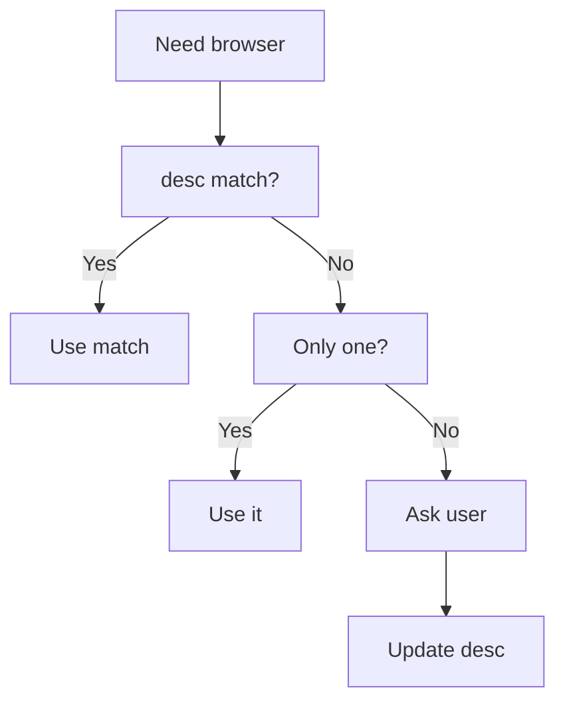

Browser-act is built for models, not for humans writing browser scripts by hand. The interface is designed around one question: **how can an AI agent understand the browser state and choose the next safe action?**

## Compact state output

Agents do not need the full DOM or verbose JSON for every step. `state` returns a compact, indexed view:

```text
url=https://example.com/login
title=Login

*[1]<div id=login-form />
  *[2]<input type=email placeholder=Email address />
  *[3]<input type=password placeholder=Password />
  *[4]<button id=submit />
    Sign In
```

The `*` marker highlights new or changed elements since the previous state call. This helps the agent focus on what changed.

| State field | How the agent uses it |
| --- | --- |
| `url` | Confirms the current page before taking action |
| `title` | Checks whether navigation reached the expected screen |
| `[N]` index | Provides the target for commands such as `click 4` or `input 2` |
| `*` marker | Points attention to elements that changed after the last action |

## Indexed interaction

Agents act by element index:

```bash
browser-act --session s1 click 4
browser-act --session s1 input 2 "hello@example.com"
```

<Columns cols={3}>
  <Card title="No selector guessing" icon="mouse-pointer-click">
    Agents do not need to generate XPath or CSS selectors for routine actions.
  </Card>
  <Card title="Same view, same actions" icon="list-ordered">
    The agent acts on the same indexed elements it sees in `state`.
  </Card>
  <Card title="Refresh after change" icon="refresh-cw">
    Calling `state` again refreshes indexes after navigation or page updates.
  </Card>
</Columns>

## Semantic browser descriptions

Each browser has a `desc` field. It tells the agent what the browser is for:

```text
Logged-in shopping account for price monitoring.
```

<Columns cols={3}>
  <Card title="Match tasks" icon="target">
    Use `desc` to match a new request to an existing browser.
  </Card>
  <Card title="Avoid duplicates" icon="copy-check">
    Reuse known browsers instead of creating new ones for the same job.
  </Card>
  <Card title="Improve over time" icon="pencil">
    Append useful context when a browser becomes associated with more workflows.
  </Card>
</Columns>

Update descriptions with:

```bash
browser-act browser update <browser_id> --desc-append "Also used for order tracking"
browser-act browser update <browser_id> --desc "New complete description"
```

## Browser selection priority

When multiple browsers exist, the agent should follow this order:

<div style={{ display: "flex", justifyContent: "center" }}>



</div>

This selection logic belongs to the Skill layer. After a user chooses, the agent should update `desc` so future tasks can match more directly.

## Safety by default

Browser automation can affect real accounts and real data. Browser-act uses confirmation rules to keep the user in control.

### Confirmation gates

Agents should ask before sensitive operations:

| Operation | Why confirmation matters |
| --- | --- |
| Create any browser | Creates a new automation endpoint |
| Delete a browser | Destroys persistent browser state |
| Import a profile | Copies login state into a managed browser |
| Change proxy settings | Changes network identity |
| Change privacy mode | Changes fingerprint and persistence behavior |
| Change `confirm_before_use` | Changes safety behavior |
| Open a `confirm_before_use` browser | Uses a browser marked as sensitive |

> [!WARNING]
> These confirmation gates are agent instructions, not a replacement for platform-level security. Their effectiveness depends on the agent runtime and model following the Skill instructions.

Example confirmation:

```text
Agent: I plan to create a stealth browser for price monitoring.
       Type: stealth
       Name: price-monitor
       Proxy: US dynamic proxy

       Continue?

User: Yes.

Agent: Running browser create.
```

Rules:

- prior approval does not carry over to a new sensitive operation
- every sensitive operation needs its own confirmation
- strong wording in the user's original prompt does not replace confirmation
- the agent should explain what it will do before doing it

### Local data handling

| Data | Location | Leaves the machine? |
| --- | --- | --- |
| Cookies | Browser-act local storage | No |
| Login sessions | Isolated browser profile | No |
| Page content | In memory during the task | No |
| Screenshots | Local file system when saved | No |
| Network captures | Memory or local HAR files | No |
| Browser profiles | Isolated local directories | No |

The exception is `solve-captcha`, which sends CAPTCHA challenge images to Browser-act cloud for solving. It should not include cookies, page content, or full URLs.

## Advanced capabilities

Browser-act includes more than simple click and input commands:

<Columns cols={2}>
  <Card title="Network capture and HAR" icon="radio">
    Find API endpoints, debug auth flows, capture XHR-loaded data, and analyze page loading.
  </Card>
  <Card title="JavaScript evaluation" icon="code">
    Run `eval` for complex extraction or page-local operations.
  </Card>
  <Card title="Cookie import and export" icon="cookie">
    Move session state between browser types, machines, or CI jobs.
  </Card>
  <Card title="Offline mode" icon="wifi-off">
    Test forms and button flows without making real network requests.
  </Card>
</Columns>

The full command list is in [Command Reference](/skill/commands).

## Learn more

<Columns cols={3}>
  <Card title="Command Reference" icon="terminal" href="/skill/commands" cta="Open index">
    Open the full Browser-act CLI command index.
  </Card>
  <Card title="Anti-detection & Blocking" icon="shield-check" href="/skill/anti-blocking" cta="Handle blocks">
    Understand blocking, CAPTCHA handling, and handoff.
  </Card>
  <Card title="Concurrency & Isolation" icon="split" href="/skill/concurrency" cta="Run safely">
    Run parallel agent work without mixing state.
  </Card>
</Columns>
