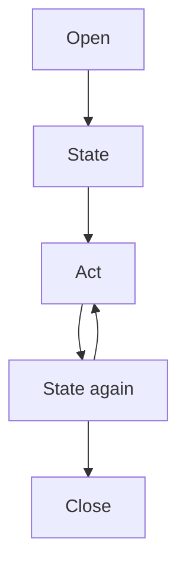

There are two fast paths:

- Use `stealth-extract` when you only need to read page content.
- Use a browser session when you need to click, type, log in, or inspect state between steps.

<Columns cols={2}>
  <Card title="Path A: Extract content" icon="file-text" href="#path-a-extract-content" cta="Read pages">
    Use `stealth-extract` for JS-rendered pages, protected content, and one-off collection.
  </Card>
  <Card title="Path B: Automate a browser" icon="mouse-pointer-click" href="#path-b-automate-a-browser" cta="Operate pages">
    Open a browser session, inspect page state, and interact with elements by index.
  </Card>
</Columns>

## Path A: extract content

Use this when basic fetchers cannot handle JavaScript rendering, anti-bot checks, or region restrictions:

```bash
browser-act stealth-extract https://example.com
```

The command opens a stealth browser, waits for the page to render, returns content as Markdown, and closes the browser. You do not need to manage a browser or session.

Common options:

```bash
# Return HTML instead of Markdown
browser-act stealth-extract https://example.com --content-type html

# Use a dynamic proxy for a specific region
browser-act stealth-extract https://example.com --dynamic-proxy JP

# Save the result to a file
browser-act stealth-extract https://example.com --output ./page.md
```

Use this path for protected content, batch collection, and information retrieval. See [Anti-detection & Blocking](/skill/anti-blocking).

## Path B: automate a browser

Use this path when the task requires interaction.

```bash
# 1. List available browsers
browser-act browser list

# 2. Open a browser and start a named session
browser-act --session my-task browser open <browser_id> https://example.com

# 3. Read the current page state
browser-act --session my-task state

# 4. Interact with elements by index
browser-act --session my-task click 4
browser-act --session my-task input 2 "hello@example.com"

# 5. Close the session when finished
browser-act session close my-task
```

## The core loop

<div style={{ display: "flex", justifyContent: "center" }}>



</div>

1. **Open** a page with `browser open`.
2. **Read state** to see the current URL, title, and indexed elements.
3. **Interact** with `click`, `input`, `select`, and related commands.
4. **Read state again** after the page changes.
5. Repeat until the task is complete.
6. **Close** the session.

## Understand `state`

`state` is the agent's view of the page. It returns compact text with indexed elements:

```text
url=https://example.com/login
title=Login

*[1]<div id=login-form />
  *[2]<input type=email placeholder=Email address />
  *[3]<input type=password placeholder=Password />
  *[4]<button id=submit />
    Sign In
  *[5]<a />
    Forgot password?
```

Each `[N]` is an element index:

```bash
browser-act --session login input 2 "user@example.com"
browser-act --session login input 3 "password123"
browser-act --session login click 4
```

Indexes can change after navigation, page updates, or DOM changes. Call `state` again before acting on a changed page.

## Chain commands carefully

> [!TIP]
> Chain commands only when each step is independent. If the next action depends on page output, run `state` first and decide from the result.

Use `&&` for independent steps:

```bash
browser-act --session s1 input 2 "user" && \
browser-act --session s1 input 3 "pass" && \
browser-act --session s1 click 4
```

Run commands separately when the next action depends on intermediate output, such as reading `state` before choosing what to click.

## Learn more

<Columns cols={3}>
  <Card title="Browser Modes" icon="panel-top" href="/skill/browser-modes" cta="Choose a mode">
    Pick Chrome, chrome-direct, stealth privacy, or stealth fixed identity.
  </Card>
  <Card title="Anti-detection & Blocking" icon="shield-check" href="/skill/anti-blocking" cta="Handle blocking">
    Use stealth, CAPTCHA solving, proxy options, and remote handoff.
  </Card>
  <Card title="Better Headless Browser" icon="eye-off" href="/skill/headless" cta="Run quietly">
    Keep browser work headless while preserving stealth and handoff.
  </Card>
  <Card title="Concurrency & Isolation" icon="split" href="/skill/concurrency" cta="Run in parallel">
    Separate browsers, sessions, accounts, and one-off jobs.
  </Card>
  <Card title="Command Reference" icon="terminal" href="/skill/commands" cta="Look up commands">
    Open the full CLI command index.
  </Card>
  <Card title="Skill Forge" icon="hammer" href="/skill/skill-forge" cta="Generate skills">
    Turn a successful exploration into a reusable scraping skill.
  </Card>
</Columns>
